# Implementasi OOP dalam Manajemen Pengelolaan Sampah di Lingkungan Desa

## Dewa Ngakan Gede Wira Adhimukti (5027251063)

## Latar Belakang
Persoalan sampah di Bali tampak seperti tak ada ujungnya dari tahun ke tahun. Banyaknya sampah berserakan, tidak adanya sistem pemilahan sampah yang baik, dan kurangnya kesadaran baik dari pemerintah dan masyarakat semakin menambah PR besar pengelolaan sampah di Bali. Sayangnya, lingkungan tempat saya tinggal juga tidak terlepas dari permasalahan tersebut. Setiap saya keluar rumah, pemandangan sampah berserakan yang menyengat akan selalu ada untuk menyapa saya. Ketika hujan, tidak lengkap rasanya tanpa luapan air yang menenuhi jalan, ditambah dengan berseraknya sampah yang menempel di jalan ketika sudah surut. Menurut saya, persoalan sampah ini harus diselesaikan dulu dari lapisan paling bawah, yakni dari kesadaran masyarakat dan lingkungan terkecil, yakni keluarga dan banjar (Di Bali tidak ada RT/RW, sistem yang serupa yakni banjar). Di banjar, harus diciptakan sistem pengelolaan sampah berbasis poin, merit, dan denda untuk memupuk kebiasaan masyarakat dalam bertanggung jawab terhadap sampah yang mereka hasilkan. Sistem tersebut harus mencakup setidaknya hal - hal berikut:

- Pencatatan dan perekapan setoran sampah yang terstruktur
- Transparansi yang jelas terhadap poin yang dikumpulkan tiap warga
- Ada pembeda poin yang jelas antar tipe sampah

Berikut adalah implementasi OOP yang saya rancang untuk permasalahan tersebut:

## Class Diagram
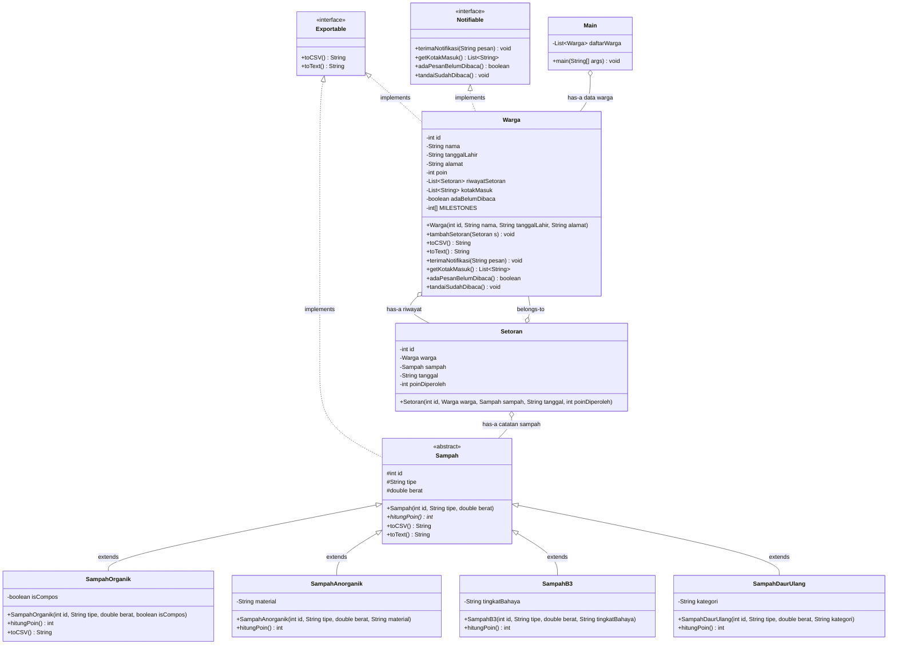

## Kode Program
Pada kasus ini, saya memisahkan file untuk setiap class untuk mempermudah melakukan perubahan dan debugging, semua class nantinya disatukan pada `Main.java`. File file tersebut dapat diakses di Berikut adalah list file program yang digunakan pada kasus ini:

- [Sampah.java](src/Sampah.java)
```java 
abstract class Sampah implements Exportable {
    private int id;
    private String tipe;
    private double berat;

    public Sampah(int id, String tipe, double berat){
        this.id = id;
        this.tipe = tipe;
        this.berat = berat;
    }

    //getter 
    int getId(){
        return id;
    }

    String getTipe(){
        return tipe;
    }

    double getBerat(){
        return berat;
    }

    //setter
    void setId(int id){
        this.id  = id;
    }

    void setTipe(String tipe){
        this.tipe = tipe;
    }
    
    void setBerat(double berat){
        this.berat = berat;
    }

    public abstract int hitungPoin();

    @Override
    public String toCSV() {
        return String.format("%d,%s,%.2f,%d", id, tipe, berat, hitungPoin());
    }
 
    @Override
    public String toText() {
        return String.format("%-26s | %.2f kg | +%d poin", tipe, berat, hitungPoin());
    }
 
    @Override
    public String toString() { return toText(); }
    

}
```
- [SampahAnorganik.java](src/SampahAnorganik.java)
```java
class SampahAnorganik extends Sampah {
    private String material;

   public SampahAnorganik(int id, String tipe, double berat, String material){
        super(id, tipe, berat);
        this.material = material;
    }

    String getMaterial(){
        return material;
    }

    void setMaterial(String material){
        this.material = material;
    }

    @Override
    public int hitungPoin(){
        int base = (int) (getBerat() * 8);
        switch (getMaterial().toLowerCase()) {
            case "logam": return base + 20;
            case "kaca":  return base + 10;
            default:      return base;
        }
    }
}
```
- [SampahB3.java](src/SampahB3.java)
```java
class SampahB3 extends Sampah{
    private String tingkatBahaya;

    public SampahB3(int id, String tipe, double berat, String tingkatBahaya){
        super(id, tipe, berat);
        this.tingkatBahaya = tingkatBahaya;
    }

    String getTingkatBahaya(){
        return tingkatBahaya;
    }

    void setTingkatBahaya(String tingkatBahaya){
        this.tingkatBahaya = tingkatBahaya;
    }

    public int hitungPoin(){
        int base = (int)(getBerat() * 10);
        switch (getTingkatBahaya().toLowerCase()) {
            case "tinggi":
                return base * 3;
            case "sedang":
                return base * 2 ;
            default:
                return base;
        }
    }
}

```
- [SampahDaurUlang.java](src/SampahDaurUlang.java)
```java
class SampahDaurUlang extends Sampah {
    private String kategori; //elektronik, kardus, botol, kertas, dan lainnya

    public SampahDaurUlang(int id, String tipe, double berat, String kategori){
        super(id, tipe, berat);
        this.kategori = kategori;
    }

    String getKategori(){
        return kategori;
    }

    void setKategori(String kategori){
        this.kategori = kategori;
    }

    @Override
    public int hitungPoin(){
        int base = (int)(getBerat() * 10);
        switch (getKategori().toLowerCase()) {
            case "elektronik":
                return base + 30;
            case "kardus":
                return base + 20;
            case "botol":
                return base + 10;
            case "kertas":
                return base + 5;
            default:
                return base;
        }
    }
    
}

```
- [SampahOrganik](src/SampahOrganik.java).java
```java
class SampahOrganik extends Sampah {

    private boolean isCompos;

    public SampahOrganik(int id, String tipe, double berat, boolean isCompos){
        super(id, tipe, berat);
        this.isCompos = isCompos;
    }

    boolean getIsCompos (){
        return isCompos;
    }

    void setIsCompos(boolean isCompos){
        this.isCompos = isCompos;
    }


    @Override
    public int hitungPoin(){
        int base = (int)(getBerat()*5);
        if (isCompos) {
            return base + 20;
        } 

        return base;
    }

    @Override
    public String toCSV() {
        return super.toCSV() + "," + (isCompos ? "bisa_kompos" : "tidak");
    }
    
}

```
- [Setoran.java](src/Setoran.java)
```java
class Setoran{
    private int id;
    private Warga warga;
    private Sampah sampah;
    private String tanggal;
    private int poinDiperoleh;
    public Setoran(int id, Warga warga, Sampah sampah, String tanggal) {
        this.id = id;
        this.warga = warga;
        this.sampah = sampah;
        this.tanggal = tanggal;
        this.poinDiperoleh = sampah.hitungPoin();
    }
    public int getId() {
        return id;
    }
    public void setId(int id) {
        this.id = id;
    }

    public Warga getWarga() {
        return warga;
    }
    public void setWarga(Warga warga) {
        this.warga = warga;
    }

    public Sampah getSampah() {
        return sampah;
    }
    public void setSampah(Sampah sampah) {
        this.sampah = sampah;
    }

    public String getTanggal() {
        return tanggal;
    }
    public void setTanggal(String tanggal) {
        this.tanggal = tanggal;
    }

    public int getPoinDiperoleh() {
        return poinDiperoleh;
    }
    public void setPoinDiperoleh(int poinDiperoleh) {
        this.poinDiperoleh = poinDiperoleh;
    }
    

    
}

```
- [Warga.java](src/Warga.java)
```java
import java.util.ArrayList;
import java.util.List;
import java.time.LocalDate;

class Warga implements Exportable, Notifiable{
    private int id; 
    private String nama;
    private String tanggalLahir;
    private String alamat;
    private int poin;
    private List<Setoran> riwayatSetoran;

    // Notifiable
    private List<String> kotakMasuk;
    private boolean      adaBelumDibaca;
    private static final int[] MILESTONES = {50, 100, 200, 500};

    
    public Warga(int id, String nama, String tanggalLahir, String alamat) {
        this.id = id;
        this.nama = nama;
        this.tanggalLahir = tanggalLahir;
        this.alamat = alamat;
        this.poin = 0;
        this.riwayatSetoran = new ArrayList<>();
        this.kotakMasuk     = new ArrayList<>();
        this.adaBelumDibaca = false;

        
    }


    public int getId() {
        return id;
    }

    public void setId(int id) {
        this.id = id;
    }


    public String getNama() {
        return nama;
    }

    public void setNama(String nama) {
        this.nama = nama;
    }


    public String getTanggalLahir() {
        return tanggalLahir;
    }

    public void setTanggalLahir(String tanggalLahir) {
        this.tanggalLahir = tanggalLahir;
    }


    public String getAlamat() {
        return alamat;
    }

    public void setAlamat(String alamat) {
        this.alamat = alamat;
    }


    public int getPoin() {
        return poin;
    }

    public void setPoin(int poin) {
        this.poin = poin;
    }


    public List<Setoran> getRiwayatSetoran() {
        return riwayatSetoran;
    }

    public void setRiwayatSetoran(List<Setoran> riwayatSetoran) {
        this.riwayatSetoran = riwayatSetoran;
    }

    public void tambahSetoran(Setoran s) {
        int poinSebelum = poin;
        riwayatSetoran.add(s);
        poin += s.getPoinDiperoleh();
 
        for (int milestone : MILESTONES) {
            if (poinSebelum < milestone && poin >= milestone) {
                terimaNotifikasi(String.format(
                    "Selamat! Kamu meraih %d poin. " +
                    "Tukarkan poin di Banjar setiap awal Bulan.", milestone));
            }
        }
    }

    //nptifable
    @Override
    public void terimaNotifikasi(String pesan) {
        kotakMasuk.add("[" + LocalDate.now() + "] " + pesan);
        adaBelumDibaca = true;
    }
 
    @Override public List<String> getKotakMasuk()     { return kotakMasuk; }
    @Override public boolean adaPesanBelumDibaca()     { return adaBelumDibaca; }
    @Override public void tandaiSudahDibaca()          { adaBelumDibaca = false; }


    //exportable
    @Override
    public String toCSV() {
        return String.format("%d,%s,%s,%s,%d,%d",
            id, nama, tanggalLahir, alamat, riwayatSetoran.size(), poin);
    }
 
    @Override
    public String toText() {
        String notif = adaBelumDibaca ? "[!]" : "   ";
        return String.format("[%d] %s %-20s | %-12s | %2d setoran | %4d poin",
            id, notif, nama, alamat, riwayatSetoran.size(), poin);
    }
 
    @Override public String toString() { return toText(); }
    
    
}
```
- [Main.java](src/Main.java)
```java
import java.util.*;
import java.io.FileWriter;
import java.io.IOException;
import java.io.PrintWriter;
import java.time.LocalDate;
import java.time.format.DateTimeFormatter;
import java.time.format.DateTimeParseException;


interface Exportable{
    String toCSV();
    String toText();
}

interface Notifiable {
    void terimaNotifikasi(String pesan);
    List<String> getKotakMasuk();
    boolean adaPesanBelumDibaca();
    void tandaiSudahDibaca();
}

public class Main {

    static List<Warga> daftarWarga  = new ArrayList<>();
    static int idWarga = 1;
    static int idSetoran = 1;
    static int idSampah  = 1;
    static Scanner input = new Scanner(System.in);

    //databse
    static final String FILE_WARGA   = "export_warga.csv";
    static final String FILE_SETORAN = "export_setoran.csv";
    static final String FILE_REPORT  = "export_laporan.txt";

    static void clearScreen() {
        try {
            if (System.getProperty("os.name").contains("Windows")) {
                new ProcessBuilder("cmd", "/c", "cls").inheritIO().start().waitFor();
            } else {
                System.out.print("\033[H\033[2J");
                System.out.flush();
            }
        } catch (Exception e) {
            for (int i = 0; i < 50; i++) System.out.println();
        }
    }

    // Baca int dengan validasi, tidak pakai nextInt() agar tidak ghost newline
    static int bacaInt(String prompt) {
        while (true) {
            System.out.print(prompt);
            try   { return Integer.parseInt(input.nextLine().trim()); }
            catch (NumberFormatException e) {
                System.out.println("[ERROR] Input harus angka bulat."); }
        }
    }
 
    // Baca double dengan validasi
    static double bacaDouble(String prompt) {
        while (true) {
            System.out.print(prompt);
            try {
                double v = Double.parseDouble(input.nextLine().trim());
                if (v <= 0) { System.out.println("[ERROR] Harus lebih dari 0."); continue; }
                return v;
            } catch (NumberFormatException e) {
                System.out.println("[ERROR] Input harus angka desimal."); }
        }
    }


    static boolean isValidTanggal(String tanggal) {
        try {
            DateTimeFormatter formatter = DateTimeFormatter.ofPattern("dd-MM-yyyy");
            LocalDate.parse(tanggal, formatter);
            return true;
        } catch (DateTimeParseException e) {
            return false;
        }
    }


    static void tambahWarga(){

        System.out.println("========================================");
        System.out.println("        MENAMBAHKAN WARGA BARU");
        System.out.println("========================================");
    
        String nama;
        while (true) {
            System.out.print("Masukkan nama: ");
            nama = input.nextLine();

            if (nama != null && nama.matches("[a-zA-Z ]+")) {
                break;
            } else {
                System.out.println("[TIDAK VALID] Nama hanya boleh huruf dan spasi.\n");
            }
        }

        String tanggalLahir;
        while (true) {
            System.out.print("Masukkan tanggal lahir (DD-MM-YYYY): ");
            tanggalLahir = input.nextLine();

            if (isValidTanggal(tanggalLahir)) {
                break;
            } else {
                System.out.println("[ERROR] Format tanggal tidak valid.\n");
            }
        }

        String alamat;
        while (true) {
            System.out.print("Masukkan alamat: ");
            alamat = input.nextLine();

            if (alamat != null && !alamat.isBlank()) {
                break;
            } else {
                System.out.println("[ERROR] Alamat tidak boleh kosong.\n");
            }
        }

        Warga w = new Warga(idWarga, nama, tanggalLahir, alamat);
        daftarWarga.add(w);

        System.out.println("\n[SUKSES] Warga berhasil ditambahkan!");
        System.out.printf("ID: %d | %s | Lahir: %s | %s%n", idWarga, nama, tanggalLahir, alamat);
        System.out.print("Tekan [Enter] untuk melanjutkan..."); input.nextLine(); // menunggu Enter
    }

    //MENU 2 - LIHAT DAFTAR WARGA
    static void lihatWarga() {
        System.out.println("========================================");
        System.out.println("         DAFTAR WARGA TERDAFTAR");
        System.out.println("========================================");

        if (daftarWarga.isEmpty()) {
            System.out.println("  (Belum ada warga terdaftar)");
        } else {
            System.out.printf("  %-4s %-20s %-14s %-25s %6s %6s%n",
                "ID", "Nama", "Tgl Lahir", "Alamat", "Setor", "Poin");
            System.out.println("  " + "-".repeat(80));
            for (Warga w : daftarWarga) {
                System.out.printf("  %-4d %-20s %-14s %-25s %6d %6d%n",
                    w.getId(), w.getNama(), w.getTanggalLahir(),
                    w.getAlamat(), w.getRiwayatSetoran().size(), w.getPoin());
            }
            System.out.println("  " + "-".repeat(80));
            System.out.printf("  Total warga terdaftar: %d%n", daftarWarga.size());
        }

        System.out.print("\nTekan [Enter] untuk melanjutkan..."); input.nextLine();
    }

    //MENU 3 - UPDATW WARGA

    static void tampilDaftarWarga() {
        if (daftarWarga.isEmpty()) { System.out.println("  (Belum ada warga terdaftar)"); return; }
        for (int i = 0; i < daftarWarga.size(); i++)
            System.out.printf("  %d. %s%n", i + 1, daftarWarga.get(i));
    }

    static Warga pilihWarga(String aksi) {
        if (daftarWarga.isEmpty()) { System.out.println("(Belum ada warga terdaftar)"); return null; }
        System.out.println("\nDaftar warga:");
        tampilDaftarWarga();
        int idx = bacaInt("Pilih nomor warga untuk " + aksi + ": ") - 1;
        if (idx < 0 || idx >= daftarWarga.size()) {
            System.out.println("[ERROR] Nomor tidak valid."); return null;
        }
        return daftarWarga.get(idx);
    }

    static void updateWarga() {
        System.out.println("========================================");
        System.out.println("          UPDATE DATA WARGA");
        System.out.println("========================================");
 
        Warga w = pilihWarga("diupdate");
        if (w == null) { System.out.print("Tekan [Enter] untuk melanjutkan..."); input.nextLine(); return; }
 
        System.out.println("\nData saat ini:");
        System.out.println("Nama          : " + w.getNama());
        System.out.println("Tanggal Lahir : " + w.getTanggalLahir());
        System.out.println("Alamat        : " + w.getAlamat());
        System.out.println("(Tekan [Enter] saja = tidak diubah)");
 
        System.out.print("\nNama baru           : ");
        String nb = input.nextLine().trim();
        if (!nb.isEmpty()) {
            if (nb.matches("[a-zA-Z ]+")) w.setNama(nb);
            else System.out.println("[SKIP] Nama tidak valid, tidak diubah.");
        }
 
        System.out.print("Tanggal lahir baru  : ");
        String tb = input.nextLine().trim();
        if (!tb.isEmpty()) {
            if (isValidTanggal(tb)) w.setTanggalLahir(tb);
            else System.out.println("[SKIP] Tanggal tidak valid, tidak diubah.");
        }
 
        System.out.print("Alamat baru         : ");
        String ab = input.nextLine().trim();
        if (!ab.isEmpty()) w.setAlamat(ab);

        System.out.println("\n[SUKSES] Data diperbarui!");
        System.out.printf("  %s | Lahir: %s | %s%n",
            w.getNama(), w.getTanggalLahir(), w.getAlamat());
        System.out.print("Tekan [Enter] untuk melanjutkan..."); input.nextLine();
    }


    //MENU 4 - HITUNG SAMPAH

    static void hitungSampah() {
        System.out.println("========================================");
        System.out.println("         CATAT SETORAN SAMPAH");
        System.out.println("========================================");

        Warga w = pilihWarga("setor sampah");
        if (w == null) { System.out.print("Tekan [Enter] untuk melanjutkan..."); input.nextLine(); return; }

        System.out.println("\nJenis sampah:");
        System.out.println("  1. Organik      (sisa makanan, daun, dll)");
        System.out.println("  2. Anorganik    (plastik / kaca / logam)");
        System.out.println("  3. B3           (baterai, cat, oli, dll)");
        System.out.println("  4. Daur Ulang   (elektronik / kardus / botol / kertas)");
        int jenis = bacaInt("Pilih jenis [1-4]: ");

        double berat = bacaDouble("Berat (kg): ");

        String tanggal;
        while (true) {
            System.out.print("Tanggal setoran (DD-MM-YYYY): ");
            tanggal = input.nextLine().trim();
            if (isValidTanggal(tanggal)) break;
            System.out.println("[ERROR] Format tidak valid. Contoh: 17-08-2025");
        }

        int sid = idSampah++;
        Sampah sampah;

        switch (jenis) {
            case 1: {
                System.out.print("Bisa dijadikan kompos? (y/n): ");
                boolean k = input.nextLine().trim().equalsIgnoreCase("y");
                sampah = new SampahOrganik(sid, k ? "Organik (kompos)" : "Organik", berat, k);
                break;
            }
            case 2: {
                String mat;
                while (true) {
                    System.out.print("Material (plastik/kaca/logam): ");
                    mat = input.nextLine().trim().toLowerCase();
                    if (List.of("plastik","kaca","logam").contains(mat)) break;
                    System.out.println("[ERROR] Pilih: plastik, kaca, atau logam.");
                }
                sampah = new SampahAnorganik(sid, "Anorganik (" + mat + ")", berat, mat);
                break;
            }
            case 3: {
                String t;
                while (true) {
                    System.out.print("Tingkat bahaya (rendah/sedang/tinggi): ");
                    t = input.nextLine().trim().toLowerCase();
                    if (List.of("rendah","sedang","tinggi").contains(t)) break;
                    System.out.println("[ERROR] Pilih: rendah, sedang, atau tinggi.");
                }
                sampah = new SampahB3(sid, "B3 [" + t + "]", berat, t);
                break;
            }
            case 4: {
                System.out.print("Kategori (elektronik/kardus/botol/kertas): ");
                String kat = input.nextLine().trim().toLowerCase();
                sampah = new SampahDaurUlang(sid, "Daur Ulang (" + kat + ")", berat, kat);
                break;
            }
            default:
                System.out.println("[ERROR] Jenis tidak valid.");
                System.out.print("Tekan [Enter] untuk melanjutkan..."); input.nextLine(); return;
        }

        Setoran setoran = new Setoran(idSetoran++, w, sampah, tanggal);
        w.tambahSetoran(setoran);

        System.out.println("\n[SUKSES] Setoran berhasil dicatat!");
        System.out.printf("  Sampah : %s%n", sampah.toText());
        System.out.printf("  Poin   : +%d (total: %d)%n",
            setoran.getPoinDiperoleh(), w.getPoin());

        if (w.adaPesanBelumDibaca()) {
            System.out.println("----------------------------------------");
            System.out.println("  ** NOTIFIKASI BARU **");
            List<String> kotak = w.getKotakMasuk();
            System.out.println("  " + kotak.get(kotak.size() - 1));
            w.tandaiSudahDibaca();
        }

        System.out.print("Tekan [Enter] untuk melanjutkan..."); input.nextLine();
    }

    //MENU 5-LIHAT LAPORAN
    static void lihatLaporan() {
        while (true) {
            clearScreen();
            System.out.println("========================================");
            System.out.println("      LIHAT DAN CETAK LAPORAN");
            System.out.println("========================================");

            if (daftarWarga.isEmpty()) {
                System.out.println("(belum ada data warga)");
                System.out.print("Tekan [Enter] untuk melanjutkan...");
                input.nextLine();
                return; 
            }

            System.out.println("  1. Laporan semua warga (teks)");
            System.out.println("  2. Ekspor CSV");
            System.out.println("  3. Riwayat setoran per warga");
            System.out.println("  4. Kembali");

            int p = bacaInt("Pilih [1-4]: ");

            switch (p) {
                case 1:
                    laporanTeks();
                    break;
                case 2:
                    laporanCSV();
                    break;
                case 3:
                    laporanPerWarga();
                    break;
                case 4:
                    return; // keluar dari loop & method
                default:
                    System.out.println("[ERROR] Tidak valid.");
            }

            System.out.print("Tekan [Enter] untuk melanjutkan...");
            input.nextLine(); // pause sebelum loop ulang
        }
    }
    
        static void laporanTeks() {
            clearScreen();
            System.out.println("========================================");
            System.out.println("   LAPORAN WARGA - SISTEM SAMPAH");
            System.out.println("========================================");
    
            List<Warga> sorted = new ArrayList<>(daftarWarga);
            sorted.sort((a, b) -> b.getPoin() - a.getPoin());
    
            int rank = 1;
            for (Warga w : sorted) {
                String medal = rank == 1 ? "[1]" : rank == 2 ? "[2]" : rank == 3 ? "[3]" : "   ";
                System.out.printf(" %s %s%n", medal, w.toText());
                rank++;
            }
    
            int    totalPoin  = daftarWarga.stream().mapToInt(Warga::getPoin).sum();
            int    totalSetor = daftarWarga.stream().mapToInt(w -> w.getRiwayatSetoran().size()).sum();
            double totalBerat = daftarWarga.stream()
                .flatMap(w -> w.getRiwayatSetoran().stream())
                .mapToDouble(s -> s.getSampah().getBerat()).sum();
    
            System.out.println("----------------------------------------");
            System.out.printf(" Total: %.2f kg | %d setoran | %d poin%n",
                totalBerat, totalSetor, totalPoin);
    
            if (!sorted.isEmpty())
                System.out.printf(" Warga teraktif: %s (%d poin)%n",
                    sorted.get(0).getNama(), sorted.get(0).getPoin());
        }
    
        static void laporanCSV() {
            try (
                PrintWriter wargaWriter = new PrintWriter(new FileWriter(FILE_WARGA));
                PrintWriter setoranWriter = new PrintWriter(new FileWriter(FILE_SETORAN))
            ) {
                // HEADER WARGA
                wargaWriter.println("id,nama,tanggalLahir,alamat,jumlahSetoran,poin");
                for (Warga w : daftarWarga) {
                    wargaWriter.println(w.toCSV());
                }

                // HEADER SETORAN
                setoranWriter.println("id,idWarga,namaWarga,tipe,berat,tanggal,poin");
                for (Warga w : daftarWarga) {
                    for (Setoran s : w.getRiwayatSetoran()) {
                        setoranWriter.printf("%d,%d,%s,%s,%.2f,%s,%d%n",
                            s.getId(),
                            s.getWarga().getId(),
                            s.getWarga().getNama(),
                            s.getSampah().getTipe(),
                            s.getSampah().getBerat(),
                            s.getTanggal(),
                            s.getPoinDiperoleh()
                        );
                    }
                }

                System.out.println("[INFO] File berhasil dibuat:");
                System.out.println("- " + FILE_WARGA);
                System.out.println("- " + FILE_SETORAN);

            } catch (IOException e) {
                System.out.println("[ERROR] Gagal menulis file: " + e.getMessage());
            }
        }
    
        static void laporanPerWarga() {
            Warga w = pilihWarga("dilihat riwayatnya");
            if (w == null) return;
    
            System.out.println("========================================");
            System.out.printf("  RIWAYAT - %s (ID: %d)%n", w.getNama(), w.getId());
            System.out.println("----------------------------------------");
    
            List<Setoran> riwayat = w.getRiwayatSetoran();
            if (riwayat.isEmpty()) {
                System.out.println("  (belum ada setoran)");
            } else {
                riwayat.forEach(System.out::println);
                System.out.println("----------------------------------------");
                System.out.printf("  Total: %d setoran | %d poin%n",
                    riwayat.size(), w.getPoin());
            }
        }

    // MENU 6-HAPUS WARGA
    static void hapusWarga() {
        System.out.println("========================================");
        System.out.println("           HAPUS DATA WARGA");
        System.out.println("========================================");

        Warga w = pilihWarga("dihapus");
        if (w == null) { System.out.print("Tekan [Enter]..."); input.nextLine(); return; }

        System.out.printf("\nYakin hapus warga '%s' (ID: %d)? (y/n): ", w.getNama(), w.getId());
        String konfirmasi = input.nextLine().trim();
        if (konfirmasi.equalsIgnoreCase("y")) {
            daftarWarga.remove(w);
            System.out.println("[SUKSES] Warga berhasil dihapus.");
        } else {
            System.out.println("[BATAL] Penghapusan dibatalkan.");
        }

        System.out.print("Tekan [Enter] untuk melanjutkan..."); input.nextLine();
    }


static void menu() {
    System.out.println("========================================");
    System.out.println("   SISTEM MANAJEMEN SAMPAH WARGA");
    System.out.println("========================================");
    System.out.println(" 1. Tambahkan Warga");
    System.out.println(" 2. Lihat Warga");
    System.out.println(" 3. Update Data Warga");
    System.out.println(" 4. Hitung Sampah");
    System.out.println(" 5. Lihat dan Cetak Laporan Sampah");
    System.out.println(" 6. Hapus Warga");
    System.out.println(" 7. Keluar");
    System.out.println("========================================");
    System.out.print  ("Pilih opsi [1-7]: ");
}
    public static void main(String[] args) throws Exception {
       while (true) {
            clearScreen();
            menu();
 
            int opsi = bacaInt("");
 
            if (opsi < 1 || opsi > 7) {
                System.out.println("[ERROR] Opsi tidak valid! Masukkan angka [1-6]");
                System.out.print("Tekan [Enter] untuk melanjutkan..."); input.nextLine();
                continue;
            }
 
            clearScreen();
 
            switch (opsi) {
                case 1: tambahWarga();  break;
                case 2: lihatWarga();   break;
                case 3: updateWarga();  break;
                case 4: hitungSampah(); break;
                case 5: lihatLaporan(); break;
                case 6: hapusWarga();   break;
                case 7:
                    System.out.println("Terima kasih. Program selesai.");
                    input.close();
                    System.exit(0);
                    break;
            }
        }
    }
}
```
## Penjelasan Alur Program
   
Sistem manajemen pengelolaan sampah ini dirancang untuk mengelola data warga, mencatat setoran sampah, dan memberikan sistem reward berupa poin. Sistem ini mengklasifikasikan sampah menjadi empat kategori utama: Organik, Anorganik, Bahan Berbahaya dan Beracun (B3), serta Daur Ulang. Setiap jenis sampah memiliki perhitungan poin spesifik berdasarkan berat dan karakteristik uniknya. Sistem juga dilengkapi dengan fitur notifikasi otomatis bagi warga yang mencapai target poin tertentu dan kapabilitas ekspor laporan ke dalam format teks serta CSV. Program bersifat interaktif, dengan isi dari menu utamanya yaitu:
1. Tambahkan Warga
2. Lihat Warga
3. Update Data Warga
4. Hitung Sampah
5. Lihat dan Cetak Laporan Sampah
    1. Laporan Semua Warga 
    2. Ekspor CSV
    3. Riwayat Setoran Per Warga
    4. Kembali

6. Hapus Warga
7. Keluar

Menu `Tambahkan Warga` berfungsi untuk menambahkan warga ke dalam list database, warga yang belum terdaftar tidak akan bisa melakukan perhitungan poin sampah.

Menu `Lihat Warga` berfungsi untuk melihat daftar nama warga yang sudah ada di dalam list database.

Menu `Update Data Warga` berfungsi untuk mengubah data warga apabila semisalnya ada kesalahan.

Menu `Hitung Sampah` berfungsi untuk menghitung nilai poin sampah dari tiap setoran yang dilakukan warga.

Menu `Lihat dan Cetak Laporan` memiliki 3 sub-menu utama, yakni:
- `Laporan Semua Warga`, berfungsi untuk melihat total laporan dari semua warga serta otomatis mencari warga dengan poin tertinggi.
- `Ekspor CSV`, berfungsi untuk membuat file csv yang berisi daftar warga dan riwayat setoran yang sudah terakumulasi secara keseluruhan.
- `Riwayat Setoran Per Warga`, berfungsi untuk melihat riwayat setoran yang dilakukan oleh warga secara perorangan.

Menu `Hapus Warga` berfungsi untuk mengapus warga dari list database.

## Konsep OOP yang digunakan
### Abstraction
Dalam sistem ini, abstraksi diterapkan melalui `interface` dan `abstract class`.

- Interface:
```java
interface Exportable{
    String toCSV();
    String toText();
}

interface Notifiable {
    void terimaNotifikasi(String pesan);
    List<String> getKotakMasuk();
    boolean adaPesanBelumDibaca();
    void tandaiSudahDibaca();
}
```
Pertama, melalui penggunaan interface seperti `Exportable` dan `Notifiable`. Interface ini berfungsi sebagai kontrak perilaku (behavior contract) yang harus dipenuhi oleh setiap kelas yang mengimplementasikannya. Secara teknis, interface hanya berisi deklarasi method tanpa implementasi, sehingga tidak ada asumsi tentang bagaimana method tersebut dijalankan. 

Sebagai contoh, Exportable dapat mendefinisikan method seperti toCSV() atau toText(). Sistem tidak peduli bagaimana format CSV dibentuk oleh masing-masing objek. Class Warga bisa mengekspor data identitas dan agregasi setoran, sementara kelas Sampah bisa mengekspor atribut seperti tipe dan berat. Keduanya memenuhi kontrak yang sama, tetapi dengan implementasi yang berbeda sesuai konteks datanya.

Hal ini secara tidak langsung menciptakan polymorphic behavior di mana sistem dapat memperlakukan semua objek Exportable secara seragam tanpa mengetahui detail internalnya. Misalnya, modul ekspor cukup memanggil toCSV() tanpa perlu melakukan type-checking atau branching berdasarkan jenis objek.

- Abstract Class
```java
abstract class {
    abstract class Sampah implements Exportable {
    private int id;
    private String tipe;
    private double berat;

    public Sampah(int id, String tipe, double berat){
        this.id = id;
        this.tipe = tipe;
        this.berat = berat;
    }

    ...

    public abstract int hitungPoin();

    ...
    }
}

```


Kedua, abstraksi diterapkan melalui konsep `Sampah` sebagai `abstract class`. Di sini, abstraksi tidak hanya mendefinisikan kontrak, tetapi juga merepresentasikan konsep umum sebagai master class atau kelas utama. Nantinya akan diciptakan sub-class dari `Sampah`, seperti `SampahOrganik`, `SampahAnorganik`, dan lain sebagainya.

### Polymorphism

## Screenshot Output
Berikut adalah dokumentasi berupa output dari sistem manajemen pengelolaan sampah yang sudah dibuat:
### Menu Utama
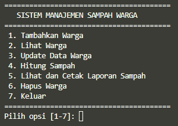

### Menu 1 - Tambahkan Warga
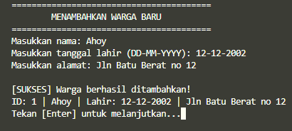

### Menu 2 - Lihat Warga
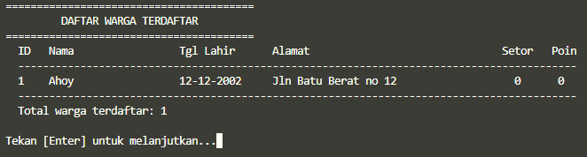

### Menu 3 - Update Data Warga
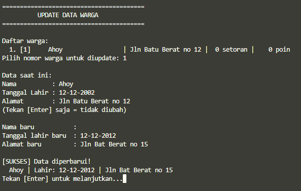

### Menu 4 - Hitung Sampah
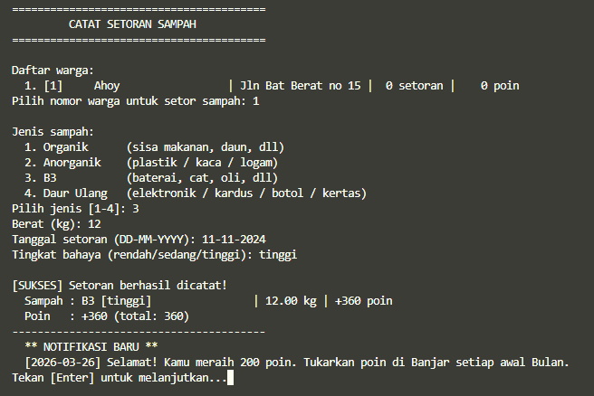

### Menu 5 - Lihat dan Cetak Laporan Sampah
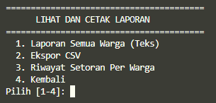

- Opsi 1 - Laporan Semua Warga

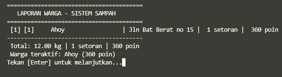

- Opsi 2 - Ekspor CSV

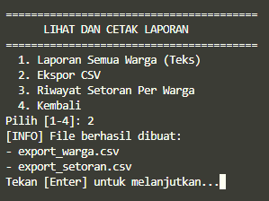

Jika memilih opsi 2, nantinya akan tercipta 2 file .csv yaitu `export_setoran.csv` dan `export_warga.csv`

 

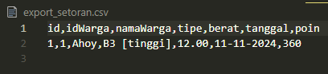

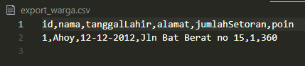

- Opsi 3 - Riwayat Setoran Per Warga

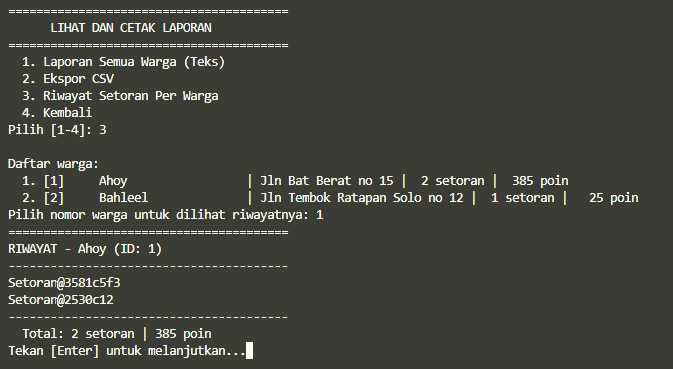

### Menu 6 - Hapus Warga

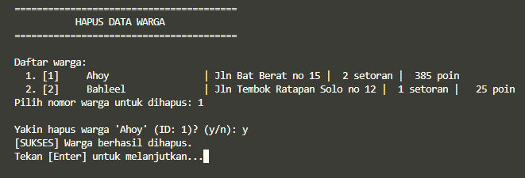


