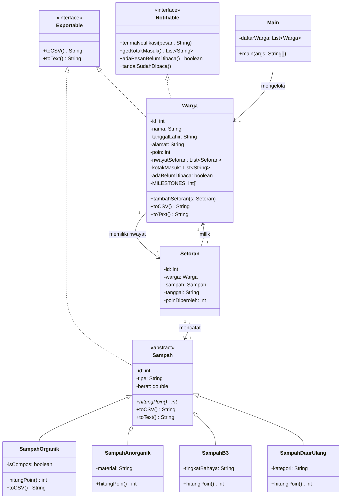

# Implementasi OOP dalam Manajemen Pengelolaan Sampah di Lingkungan Desa

### Latar Belakang
Persoalan sampah di Bali tampak seperti tak ada ujungnya dari tahun ke tahun. Banyaknya sampah berserakan, tidak adanya sistem pemilahan sampah yang baik, dan kurangnya kesadaran baik dari pemerintah dan masyarakat semakin menambah PR besar pengelolaan sampah di Bali. Sayangnya, lingkungan tempat saya tinggal juga tidak terlepas dari permasalahan tersebut. Setiap saya keluar rumah, pemandangan sampah berserakan yang menyengat akan selalu ada untuk menyapa saya. Ketika hujan, tidak lengkap rasanya tanpa luapan air yang menenuhi jalan, ditambah dengan berseraknya sampah yang menempel di jalan ketika sudah surut. Menurut saya, persoalan sampah ini harus diselesaikan dulu dari lapisan paling bawah, yakni dari kesadaran masyarakat dan lingkungan terkecil, yakni keluarga dan banjar (Di Bali tidak ada RT/RW, sistem yang serupa yakni banjar). Di banjar, harus diciptakan sistem pengelolaan sampah berbasis poin, merit, dan denda untuk memupuk kebiasaan masyarakat dalam bertanggung jawab terhadap sampah yang mereka hasilkan. Sistem tersebut harus mencakup setidaknya hal - hal berikut:

- Pencatatan dan perekapan setoran sampah yang terstruktur
- Transparansi yang jelas terhadap poin yang dikumpulkan tiap warga
- Ada pembeda poin yang jelas antar tipe sampah

Berikut adalah implementasi OOP yang saya rancang untuk permasalahan tersebut:

## Class Diagram

