# Tugas 3 Struktur Data dan Pemrograman Berorientasi Objek -  Eksplorasi dan Implementasi Tree

- [Tugas 3 Struktur Data dan Pemrograman Berorientasi Objek -  Eksplorasi dan Implementasi Tree](#tugas-3-struktur-data-dan-pemrograman-berorientasi-objek----eksplorasi-dan-implementasi-tree)
  - [Anggota Kelompok](#anggota-kelompok)
  - [Tree Dasar dan Variasi](#tree-dasar-dan-variasi)
  - [Referensi Paper](#referensi-paper)
  - [Link Github Tugas](#link-github-tugas)
  - [Problem Statement / Permasalahan](#problem-statement--permasalahan)
  - [Penjelasan Struktur dan Algoritma serta Visualisasi B-Tree dan B+ Tree](#penjelasan-struktur-dan-algoritma-serta-visualisasi-b-tree-dan-b-tree)
    - [B-Tree](#b-tree)
      - [Karakteristik B-Tree](#karakteristik-b-tree)
      - [Struktur Node B-Tree](#struktur-node-b-tree)
      - [Aturan Key dan Child B-Tree](#aturan-key-dan-child-b-tree)
      - [Algoritma Operasi B-Tree](#algoritma-operasi-b-tree)
        - [Search](#search)
        - [Insert](#insert)
        - [Split](#split)
        - [Delete](#delete)
        - [Ordered Traversal](#ordered-traversal)
      - [Visualisasi B-Tree](#visualisasi-b-tree)
    - [B+ Tree](#b-tree-1)
      - [Karakteristik B+ Tree](#karakteristik-b-tree-1)
      - [Struktur Node B+ Tree](#struktur-node-b-tree-1)
      - [Algoritma Operasi B+ Tree](#algoritma-operasi-b-tree-1)
        - [Search](#search-1)
        - [Insert](#insert-1)
        - [Split](#split-1)
        - [Delete](#delete-1)
        - [Sequential Traversal / Range Query](#sequential-traversal--range-query)
      - [Visualisasi B+ Tree](#visualisasi-b-tree-1)
  - [Aplikasi/Implementasi dari B-Tree dan B+ Tree](#aplikasiimplementasi-dari-b-tree-dan-b-tree)
    - [Database Management System](#database-management-system)
    - [Sistem Basis Data Komersial](#sistem-basis-data-komersial)
    - [In - Memory Database](#in---memory-database)
    - [Kompresi Index](#kompresi-index)
  - [Keunggulan dan Kekurangan](#keunggulan-dan-kekurangan)
    - [Keunggulan B-Tree](#keunggulan-b-tree)
    - [Kekurangan B-Tree](#kekurangan-b-tree)
    - [Keunggulan B+ Tree](#keunggulan-b-tree-1)
    - [Kekurangan B+ Tree](#kekurangan-b-tree-1)
    - [Keunggulan B-Tree dan B+ Tree Berdasarkan Optimasi Kompresi](#keunggulan-b-tree-dan-b-tree-berdasarkan-optimasi-kompresi)
    - [Batasan B-Tree dan B+ Tree Berdasarkan Optimasi Kompresi](#batasan-b-tree-dan-b-tree-berdasarkan-optimasi-kompresi)
  - [Perbandingan B Tree dan B+ Tree Secara Teori](#perbandingan-b-tree-dan-b-tree-secara-teori)
    - [Karakteristik B Tree](#karakteristik-b-tree-2)
    - [Karakteristik B+ Tree](#karakteristik-b-tree-3)
    - [Perbandingan Utama](#perbandingan-utama)
      - [Perbedaan Penyimpanan Key dan Data](#perbedaan-penyimpanan-key-dan-data)
      - [Perbedaan Struktur Leaf Node](#perbedaan-struktur-leaf-node)
      - [Perbedaan Logika Search](#perbedaan-logika-search)
      - [Perbedaan Sequential Access dan Range Query](#perbedaan-sequential-access-dan-range-query)
      - [Perbedaan Insertion dan Splitting](#perbedaan-insertion-dan-splitting)
      - [Perbedaan Efisiensi Teoretis](#perbedaan-efisiensi-teoretis)
      - [Ringkasan Perbedaan](#ringkasan-perbedaan)
  - [Analisis Kompleksitas Berdasarkan Struktur Tree](#analisis-kompleksitas-berdasarkan-struktur-tree)
  - [Potensi Pengembangan ke Depan](#potensi-pengembangan-ke-depan)
    - [Sistem Kompresi Adaptif](#sistem-kompresi-adaptif)
    - [Pengembangan PkB-tree untuk Penyimpanan Modern](#pengembangan-pkb-tree-untuk-penyimpanan-modern)
    - [Integrasi dengan Learned Index](#integrasi-dengan-learned-index)
    - [Optimasi untuk Large Page Size](#optimasi-untuk-large-page-size)
    - [Optimasi pada Composite Key](#optimasi-pada-composite-key)
    - [Integrasi dengan Learned Index](#integrasi-dengan-learned-index-1)
    - [Pengembangan PkB-tree untuk Penyimpanan Modern](#pengembangan-pkb-tree-untuk-penyimpanan-modern-1)
  - [Hasil Implementasi](#hasil-implementasi)
    - [Overview Program](#overview-program)
    - [Ringkasan Perbedaan Implementasi B-Tree dan B+ Tree dalam Program](#ringkasan-perbedaan-implementasi-b-tree-dan-b-tree-dalam-program)
    - [Menu dan Fitur Program](#menu-dan-fitur-program)
    - [Progam B-Tree](#progam-b-tree)
      - [Gambaran Umum Program B-Tree](#gambaran-umum-program-b-tree)
      - [Penjelasan Implementasi pada Kode](#penjelasan-implementasi-pada-kode)
      - [Demonstrasi Program](#demonstrasi-program)
    - [Program B+ Tree](#program-b-tree)
      - [Gambaran Umum Program B+ Tree](#gambaran-umum-program-b-tree-1)
      - [Penjelasan Implementasi Pada Kode](#penjelasan-implementasi-pada-kode-1)
    - [Demonstrasi Program](#demonstrasi-program-1)
  - [Perbandingan Performa Kedua Tree pada Program](#perbandingan-performa-kedua-tree-pada-program)


## Anggota Kelompok


| No | Nama | NRP |
|----|------|-----|
| 1  | Ferlin Erdina Sari | 5027251002 |
| 2  | Az Zahra Fiddien Al Farabi | 5027251021 |
| 3  | Dewa Ngakan Gede Wira Adhimukti | 5027251063 |
| 4  | Azhari Rahma Putri | 5027251114 |
| 5  | Muhamad Nasrulhaq| 5027251117 |

## Tree Dasar dan Variasi
Pada tugas ini, kelompok kami memilih untuk melakukan eksplorasi dan implementasi terhadap `B-Tree` dengan variannya yaitu `B+ Tree`.

## Referensi Paper
1. **Fabian Burghart dan Stephan Wagner, _On the histories of B-trees_**. Paper ini membahas B-Tree sebagai struktur search tree seimbang, aturan jumlah key di setiap node, posisi leaf, serta mekanisme insertion dan splitting. [[Paper B-Tree]](Paper1_BTree.pdf)
2. **Imran A. Adeleke, Adegbuyi D. Gbadebo, dan Abayomi O. Dawodu, _A B+-Tree-Based Indexing and Storage of Numerical Records in School Databases_**. Paper ini membahas B+ Tree sebagai struktur indexing untuk penyimpanan dan pencarian data, terutama pada konteks database dan penyimpanan berbasis blok. [[Paper B+ Tree]](Paper2_BPlusTree.pdf)

## Link Github Tugas
```
https://github.com/o-deraa/Strukdat-OOP-2026/tree/main/Tugas%203%20-%20Eksplorasi%20dan%20Implementasi%20Tree
```


## Problem Statement / Permasalahan

Pada era digital saat ini, jumlah data yang disimpan dan diproses oleh sistem komputer terus meningkat dengan sangat cepat. Database, cloud storage, search engine, dan berbagai aplikasi modern membutuhkan proses pencarian dan pengelolaan data yang cepat serta efisien. Jika data disimpan menggunakan struktur linear seperti `array` atau `linked list`, maka proses pencarian data akan menjadi lambat ketika jumlah data semakin besar. Oleh karena itu, dibutuhkan struktur data yang mampu mengatur data secara terstruktur agar akses terhadap data tetap efisien.

Salah satu solusi yang digunakan untuk mengatasi masalah tersebut adalah struktur data `tree`. Struktur data `tree` memungkinkan data disusun secara hierarkis sehingga proses pencarian, penyisipan, dan penghapusan data dapat dilakukan dengan lebih terorganisir dibandingkan struktur linear. Alih-alih memeriksa data satu per satu dari awal sampai akhir, sistem dapat menelusuri cabang tertentu berdasarkan nilai yang dicari. Pola ini membuat tree lebih efisien dibandingkan struktur linear dalam banyak kasus.

Namun, tidak semua `tree` memiliki performa yang stabil. `Binary Search Tree `biasa, misalnya, dapat berubah menjadi sangat tidak seimbang jika data masuk dalam urutan tertentu. Ketika tree menjadi terlalu tinggi, proses pencarian dapat mendekati kompleksitas linear. Oleh karena itu, dibutuhkan struktur tree yang mampu menjaga keseimbangan tinggi pohon secara otomatis. Dari kebutuhan inilah muncul berbagai struktur `balanced tree`, salah satunya adalah `B-Tree`.
`B-Tree` adalah salah  satu struktur yang paling banyak digunakan pada database dan file system adalah. Berdasarkan paper _On the histories of B-trees_, `B-Tree` dirancang untuk menjaga keseimbangan struktur tree dengan menempatkan seluruh leaf pada level yang sama sehingga performa pencarian data tetap stabil.

B-Tree dirancang untuk menyimpan banyak key dalam satu node dan menjaga semua leaf berada pada level yang sama. Dengan cara ini, tinggi tree dapat tetap rendah walaupun jumlah data sangat besar. Karakteristik ini membuat B-Tree sangat cocok digunakan pada database dan file system, terutama karena sistem penyimpanan sekunder seperti disk bekerja lebih efisien jika jumlah akses ke node dapat ditekan.

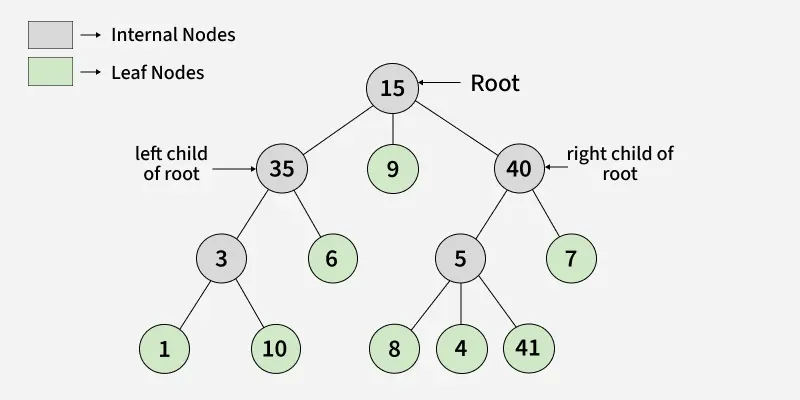
Sumber: geeksforgeeks.com

Seiring berkembangnya kebutuhan database modern, muncul pengembangan dari `B-Tree` yaitu `B+ Tree`. `B+ Tree` dikembangkan untuk meningkatkan efisiensi indexing dan sequential access pada sistem database.` B+ Tree` mempertahankan prinsip keseimbangan B-Tree, tetapi mengubah cara penyimpanan data. Berbeda dengan `B-Tree`, internal node hanya digunakan sebagai index atau penunjuk arah pencarian, sedangkan seluruh data aktual disimpan pada leaf node yang saling terhubung sehingga proses traversal data dan range query menjadi lebih cepat. Oleh karena itu, `B+ Tree` banyak digunakan pada DBMS modern seperti MySQL dan PostgreSQL sebagai struktur indexing utama.

## Penjelasan Struktur dan Algoritma serta Visualisasi B-Tree dan B+ Tree

### B-Tree
#### Karakteristik B-Tree
Berdasarkan _On the histories of B-trees_, sebuah `B-Tree` berorde 2m+1 adalah search tree yang memenuhi properti berikut: 
- Setiap node menyimpan antara m hingga 2m key, kecuali root yang boleh memiliki minimal 1 key.
- Setiap non-leaf node dengan k key memiliki tepat k+1 child.
- Semua leaf node berada pada kedalaman yang sama (tree seimbang).
- Key dalam setiap node disimpan urut dari kiri ke kanan.
- Child ke-i berisi key yang berada di antara key ke-(i-1) dan ke-i dari parent-nya. 
#### Struktur Node B-Tree
Setiap node dalam `B-Tree` menyimpan sejumlah key yang terurut dan pointer yang menghubungkan ke node-node child-nya. Mengacu pada definisi Burghart dan Wagner (2026), sebuah node dengan k key memiliki struktur sebagai berikut:

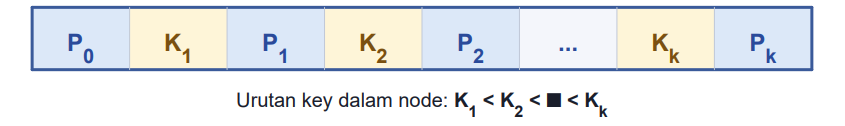

Ki adalah key ke-i yang disimpan secara berurutan (K1<K2<⋯<Kk​), dan Pi​ adalah pointer ke child node. Makna dari setiap pointer mengikuti aturan pencarian yaitu P0​ mengarah ke subtree yang memuat semua key lebih kecil dari K1, setiap Pi​ untuk 0<i<k mengarah ke subtree dengan key di antara Ki dan Ki+1​, dan Pk​ mengarah ke subtree dengan semua key lebih besar dari Kk​.

#### Aturan Key dan Child B-Tree
Pada _On the histories of B-trees_, disebutkan bahwa sebuah `B-Tree` berorde 2m+1 untuk suatu bilangan bulat positif m harus memenuhi dua aturan utama terkait jumlah key dan child pada setiap node. Pertama, setiap node menyimpan paling sedikit m key dan paling banyak 2m key, satu-satunya pengecualian adalah node root yang boleh memiliki hanya 1 key. Kedua, setiap non-leaf node yang memuat k key memiliki tepat k+1 node child. Ini berarti jumlah child selalu lebih satu dibanding jumlah key dalam node tersebut. 

Properti keseimbangan juga menjadi bagian inti dari struktur ini: semua leaf node berada pada kedalaman yang sama dari root, sehingga panjang path dari root ke setiap leaf selalu identik. Inilah yang menjamin kompleksitas pencarian tetap O(logn) dalam semua kondisi.

#### Algoritma Operasi B-Tree

##### Search

Operasi search pada B-Tree digunakan untuk mencari sebuah key dengan memanfaatkan urutan key di dalam setiap node. Pencarian dimulai dari root. Pada setiap node, key yang dicari dibandingkan dengan key-key yang tersimpan di node tersebut.

Jika key ditemukan pada node saat ini, proses pencarian selesai. Jika key tidak ditemukan dan node tersebut bukan leaf, maka pencarian dilanjutkan ke child yang sesuai dengan interval nilai key. Misalnya, jika key lebih kecil dari key pertama, pencarian masuk ke pointer paling kiri. Jika key berada di antara dua key, pencarian masuk ke pointer di antara kedua key tersebut. Jika key lebih besar dari key terakhir, pencarian masuk ke pointer paling kanan.

Jika pencarian sudah mencapai leaf node dan key tetap tidak ditemukan, maka key tersebut tidak ada di dalam B-Tree. Karena tinggi B-Tree dijaga tetap rendah, operasi search memiliki kompleksitas waktu logaritmik terhadap jumlah data.

Alur langkah - langkahnya:
Pseudocode Search B-Tree

1) Mulai dari root.
2) Bandingkan key yang dicari dengan key pada node.
3) Jika key ditemukan -> proses selesai.
4) Jika key tidak ditemukan dan node adalah leaf -> key tidak ada.
5) Jika node bukan leaf, pilih child berdasarkan interval nilai key.
6) Jika key lebih kecil dari key pertama -> masuk ke child paling kiri.
7) Jika key berada di antara dua key -> masuk ke child di antaranya.
8) Jika key lebih besar dari key terakhir -> masuk ke child paling kanan.
9) Ulangi sampai key ditemukan atau pencarian berhenti di leaf.


##### Insert

Operasi insert pada B-Tree dilakukan dengan mencari leaf node yang sesuai untuk key baru. Setelah posisi leaf ditemukan, key dimasukkan ke dalam node tersebut secara terurut.

Jika jumlah key pada leaf masih tidak melebihi batas maksimum, proses insert selesai. Namun, jika node mengalami overflow, yaitu jumlah key melebihi kapasitas maksimum, maka dilakukan split. Pada B-Tree berorde `2m + 1`, overflow terjadi ketika node berisi `2m + 1` key.

Saat split terjadi, median key dipindahkan ke parent node. Key yang lebih kecil dari median membentuk node kiri, sedangkan key yang lebih besar dari median membentuk node kanan. Jika parent juga mengalami overflow, proses split dapat berlanjut secara rekursif ke atas. Jika root mengalami split, maka root baru dibuat dan tinggi B-Tree bertambah satu.

Alur langkah - langkahnya:

1) Mulai dari root.
2) Telusuri node untuk menemukan leaf yang sesuai bagi key baru.
3) Jika key lebih kecil dari key pada node -> lanjut ke child kiri yang sesuai.
4) Jika key berada di antara dua key ->  lanjut ke child di antara kedua key tersebut.
5) Jika key lebih besar dari key terakhir ->  lanjut ke child paling kanan.
6) Ulangi sampai mencapai leaf node.
7) Masukkan key baru ke leaf node secara terurut.
8) Jika jumlah key masih berada dalam batas maksimum ->  proses insert selesai.
9) Jika node mengalami overflow ->  lakukan split.
10) Pada proses split, pilih key median.
11) Naikkan key median ke parent node.
12) Key yang lebih kecil dari median menjadi bagian node kiri.
13) Key yang lebih besar dari median menjadi bagian node kanan.
14) Jika parent mengalami overflow ->  ulangi proses split ke arah atas.
15) Jika root mengalami overflow ->  buat root baru dari median hasil split.
16) Jadikan dua node hasil split sebagai child dari root baru.
17) Proses insert selesai.
18) 

##### Split

Split adalah proses pemecahan node yang mengalami overflow. Pada B-Tree berorde `2m + 1`, sebuah node hanya boleh menyimpan maksimal `2m` key. Jika setelah insertion sebuah node berisi `2m + 1` key, maka node tersebut harus dipecah.

Key tengah atau median dipindahkan ke parent node. Sebanyak `m` key yang lebih kecil dari median ditempatkan pada node kiri, sedangkan `m` key yang lebih besar dari median ditempatkan pada node kanan. Jika node yang di-split adalah internal node, maka pointer child juga harus dibagi mengikuti pembagian key tersebut.

Jika parent node ikut melebihi kapasitas setelah menerima median, proses split dilakukan lagi pada parent. Proses ini dapat terus naik hingga root. Jika root mengalami split, maka root baru dibuat dan tinggi B-Tree bertambah.

Alur langkah - langkahnya:
1) Mulai dari node yang mengalami overflow.
2) Tentukan median key dari node tersebut.
3) Pindahkan median key ke parent node.
4) Key yang lebih kecil dari median menjadi bagian node kiri.
5) Key yang lebih besar dari median menjadi bagian node kanan.
6) Jika node yang di-split adalah internal node, bagi pointer child sesuai pembagian key.
7) Hubungkan node kiri dan node kanan ke parent node.
8) Jika parent tidak overflow -> proses selesai.
9) Jika parent overflow -> ulangi proses split pada parent.
10) Jika split terjadi pada root -> buat root baru.
11) Jadikan median key sebagai isi root baru.
12) Jadikan node kiri dan node kanan sebagai child dari root baru.
13) Tinggi B-Tree bertambah satu.
14) Proses split selesai.

##### Delete

Operasi delete pada B-Tree digunakan untuk menghapus key tanpa melanggar aturan jumlah minimum key pada setiap node. Jika key berada pada leaf node dan setelah dihapus jumlah key masih memenuhi batas minimum, maka key dapat langsung dihapus.

Jika key berada pada internal node, key tersebut biasanya diganti dengan predecessor atau successor agar urutan key tetap terjaga. Setelah itu, penghapusan dilakukan pada leaf yang memuat predecessor atau successor tersebut.

Jika setelah penghapusan sebuah node memiliki key kurang dari batas minimum, maka terjadi underflow. Underflow dapat ditangani dengan borrowing dari sibling yang masih memiliki cukup key, atau dengan merge jika sibling juga berada pada batas minimum. Jika proses merge membuat parent kekurangan key, penyesuaian dapat merambat ke atas hingga root.

Alur langkah - langkahnya:
1) Mulai dari root.
2) Cari key yang ingin dihapus.
3) Jika key tidak ditemukan -> proses selesai.
4) Jika key berada pada leaf node -> hapus key dari leaf.
5) Jika key berada pada internal node -> ganti key dengan predecessor atau successor.
6) Hapus predecessor atau successor dari leaf asalnya.
7) Setelah penghapusan, cek apakah node kekurangan key.
8) Jika jumlah key masih memenuhi batas minimum -> proses selesai.
9) Jika node mengalami underflow -> cek sibling terdekat.
10) Jika sibling memiliki key lebih dari batas minimum -> lakukan borrowing.
11) Jika sibling tidak memiliki cukup key -> lakukan merge dengan sibling.
12) Jika merge menyebabkan parent underflow -> ulangi penanganan underflow ke atas.

13) Jika root menjadi kosong -> jadikan child root sebagai root baru.

14) Proses delete selesai.
   
##### Ordered Traversal

Traversal pada B-Tree dapat digunakan untuk menampilkan seluruh key secara terurut. Karena satu node dapat menyimpan lebih dari satu key dan memiliki lebih dari dua child, pola traversal B-Tree berbeda dari Binary Search Tree.

Untuk node dengan key `K1, K2, ..., Kk` dan pointer `P0, P1, ..., Pk`, traversal terurut dilakukan dengan pola:

`P0 -> K1 -> P1 -> K2 -> P2 -> ... -> Kk -> Pk`

Dengan cara ini, seluruh key dalam B-Tree dapat ditampilkan dari nilai terkecil hingga terbesar. Namun, untuk operasi range query dan sequential access, B+ Tree biasanya lebih efisien karena seluruh data berada pada leaf node dan leaf node saling terhubung.

#### Visualisasi B-Tree
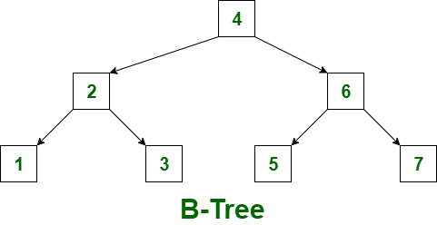
Sumber: geeksforgeeks.com

### B+ Tree

#### Karakteristik B+ Tree
`B+ Tree` adalah struktur data tree seimbang yang dirancang untuk mendukung pencarian, penyisipan, penghapusan, dan pembacaan data secara berurutan dengan efisien. Struktur ini banyak digunakan pada sistem basis data dan file system karena mampu menjaga tinggi pohon tetap rendah meskipun jumlah data yang disimpan sangat besar.

Perbedaan utama `B+ Tree` dibandingkan `B-Tree` terletak pada cara penyimpanan data. Pada `B+ Tree`, internal node tidak menyimpan data aktual, melainkan hanya menyimpan key penunjuk atau separator key yang digunakan untuk mengarahkan proses pencarian. Data aktual atau pointer menuju record hanya disimpan pada leaf node.

Semua leaf node pada `B+ Tree` berada pada kedalaman yang sama. Hal ini membuat struktur `B+ Tree` tetap seimbang, sehingga operasi pencarian tidak mengalami kasus terburuk seperti pada binary search tree yang tidak seimbang. Selain itu, leaf node pada `B+ Tree` saling terhubung menggunakan pointer horizontal, sehingga data dapat dibaca secara berurutan tanpa harus kembali melakukan traversal dari root.

Karena internal node hanya berisi key penunjuk dan pointer ke child, internal node dapat menampung lebih banyak percabangan atau fan-out. Fan-out yang besar membuat tinggi tree menjadi lebih rendah, sehingga jumlah node atau halaman yang perlu diakses selama pencarian dapat dikurangi.

#### Struktur Node B+ Tree
Struktur node pada `B+ Tree` dibagi menjadi dua jenis utama, yaitu internal node dan leaf node. Keduanya memiliki peran yang berbeda.

Internal node berfungsi sebagai pengarah pencarian. Node ini menyimpan key penunjuk dan pointer menuju child node. Jika sebuah internal node memiliki `k` key, maka node tersebut dapat memiliki `k + 1` pointer child. Key di internal node tidak merepresentasikan data aktual, tetapi hanya menjadi batas nilai untuk menentukan ke subtree mana pencarian harus dilanjutkan.

Secara umum, struktur internal node dapat digambarkan seperti berikut:

`P0 | K1 | P1 | K2 | P2 | ... | Kk | Pk`

Makna dari struktur tersebut adalah:

- `P0` mengarah ke subtree dengan nilai lebih kecil dari `K1`.
- `P1` mengarah ke subtree dengan nilai di antara `K1` dan `K2`.
- Pointer berikutnya mengikuti interval nilai yang sesuai.
- `Pk` mengarah ke subtree dengan nilai lebih besar atau sama dengan key terakhir, tergantung aturan separator yang digunakan.

Leaf node berfungsi sebagai tempat penyimpanan data aktual. Pada leaf node, setiap key biasanya dipasangkan dengan data record atau pointer menuju record asli di database. Berbeda dengan internal node, leaf node tidak memiliki child pointer ke bawah, tetapi memiliki pointer horizontal menuju leaf node berikutnya.

Hubungan antar-leaf inilah yang menjadi ciri penting `B+ Tree`. Setelah sistem menemukan leaf node pertama yang sesuai, sistem dapat melanjutkan pembacaan ke leaf berikutnya secara berurutan. Karena itu, `B+ Tree` sangat efisien untuk sequential access dan range query.

Jika sebuah `B+ Tree` memiliki order `m`, maka internal node umumnya dapat memiliki maksimal `m` child dan maksimal `m - 1` key. Node selain root harus memenuhi batas minimum tertentu agar tree tetap seimbang. Namun, detail batas minimum dapat berbeda tergantung konvensi implementasi yang digunakan.

#### Algoritma Operasi B+ Tree
##### Search
Operasi search pada `B+ Tree` digunakan untuk mencari data berdasarkan key tertentu. Pencarian selalu dimulai dari root node dan bergerak dari atas ke bawah hingga mencapai leaf node.

Pada setiap internal node, key yang dicari dibandingkan dengan separator key yang ada di node tersebut. Jika key yang dicari lebih kecil dari separator tertentu, pencarian diarahkan ke pointer child yang berada di sebelah kiri separator tersebut. Jika key lebih besar atau sama, pencarian diarahkan ke child yang sesuai di sebelah kanan atau pada interval berikutnya.

Berbeda dengan `B-Tree`, pencarian pada `B+ Tree` tidak berhenti di internal node meskipun nilai key yang dicari sama dengan key yang ada di internal node. Hal ini karena internal node hanya berfungsi sebagai penunjuk arah, bukan tempat penyimpanan data aktual. Oleh karena itu, pencarian harus tetap dilanjutkan sampai leaf node.

Setelah mencapai leaf node, sistem mencari key di dalam leaf tersebut. Pencarian di dalam leaf dapat dilakukan secara linear atau menggunakan binary search, tergantung implementasi. Jika key ditemukan, maka data record atau pointer menuju record dikembalikan. Jika key tidak ditemukan sampai leaf node selesai diperiksa, maka data tersebut tidak ada di dalam tree.

Secara umum, kompleksitas search pada `B+ Tree` adalah `O(log n)`. Dalam konteks database, efisiensi ini sangat penting karena tinggi tree yang rendah membuat jumlah akses halaman atau disk page menjadi lebih sedikit.

Alur langkah - langkahnya:

1) Mulai dari root.
2) Bandingkan key yang dicari dengan separator key pada node saat ini.
3) Jika node saat ini adalah internal node, pilih child yang sesuai berdasarkan interval nilai key.
4) Jika key lebih kecil dari separator tertentu -> masuk ke child kiri.
5) Jika key lebih besar atau sama dengan separator tertentu -> masuk ke child kanan.
6) Jangan berhenti di internal node, meskipun key sama dengan separator key.
7) Ulangi proses sampai mencapai leaf node.
8) Cari key di dalam leaf node.
9) Jika key ditemukan -> kembalikan data record atau pointer record.
10) Jika key tidak ditemukan -> data tidak ada di dalam `B+ Tree`.
11) Proses search selesai.

##### Insert
Operasi insert pada `B+ Tree` digunakan untuk menambahkan key dan data baru ke dalam tree. Karena data aktual pada `B+ Tree` hanya disimpan di leaf node, proses insert selalu diarahkan ke leaf node yang sesuai.

Langkah pertama dalam insert adalah melakukan search untuk menemukan leaf node tempat key baru seharusnya berada. Setelah leaf node ditemukan, key baru dimasukkan ke dalam leaf tersebut secara terurut.

Jika leaf node masih memiliki ruang kosong, proses insert selesai. Struktur tree tidak perlu diubah karena aturan kapasitas node masih terpenuhi. Namun, jika leaf node sudah penuh, maka perlu dilakukan split pada leaf node tersebut.

Pada saat split leaf node, key baru biasanya dimasukkan terlebih dahulu ke dalam kumpulan key sementara agar seluruh key tetap terurut. Setelah itu, kumpulan key tersebut dibagi menjadi dua leaf node. Sebagian key tetap berada pada leaf lama, sedangkan sisanya dipindahkan ke leaf baru.

Key terkecil dari leaf baru kemudian disalin ke parent node sebagai separator key. Pada `B+ Tree`, key yang naik dari leaf ke parent bersifat disalin, bukan dipindahkan sepenuhnya. Artinya, key tersebut tetap ada di leaf node karena data aktual tetap harus berada di leaf.

Jika parent node masih memiliki ruang, separator key langsung dimasukkan ke parent. Namun, jika parent juga penuh, maka split akan berlanjut ke internal node. Proses ini dapat merambat ke atas hingga root. Jika root ikut mengalami split, maka dibuat root baru dan tinggi `B+ Tree` bertambah satu.

Aluir langkah - langkahnya:

1) Mulai dari root.
2) Cari leaf node yang sesuai untuk key baru.
3) Pada setiap internal node, pilih child berdasarkan separator key.
4) Ulangi sampai mencapai leaf node.
5) Masukkan key dan data baru ke leaf node secara terurut.
6) Jika leaf masih memiliki ruang -> proses insert selesai.
7) Jika leaf penuh -> lakukan split leaf node.
8) Bagi key menjadi dua leaf node secara terurut.
9) Hubungkan leaf lama dan leaf baru.
10) Salin key terkecil dari leaf baru ke parent sebagai separator key.
11) Jika parent masih memiliki ruang -> proses selesai.
12) Jika parent penuh -> lakukan split pada internal node.
13) Jika split merambat sampai root -> buat root baru.
    14) Tinggi `B+ Tree` bertambah satu.
15) Proses insert selesai.

##### Split

Split adalah proses membagi node yang penuh agar aturan kapasitas `B+ Tree` tetap terpenuhi. Split dapat terjadi pada leaf node maupun internal node, tetapi mekanismenya berbeda.

Pada leaf node, split dilakukan ketika leaf tidak lagi mampu menampung key baru. Setelah key baru dimasukkan secara sementara dan seluruh key diurutkan, key-key tersebut dibagi menjadi dua leaf node. Leaf lama menyimpan sebagian key awal, sedangkan leaf baru menyimpan key sisanya.

Setelah split leaf dilakukan, key terkecil dari leaf baru disalin ke parent node. Key ini digunakan sebagai separator agar pencarian berikutnya dapat diarahkan ke leaf yang benar. Selain itu, pointer horizontal antar-leaf harus diperbarui. Leaf lama harus menunjuk ke leaf baru, dan leaf baru harus menunjuk ke leaf berikutnya yang sebelumnya ditunjuk oleh leaf lama.

Pada internal node, split dilakukan ketika internal node tidak mampu menampung separator key baru dari child. Berbeda dengan split leaf, key tengah pada internal node akan dipromosikan ke parent. Key tengah ini tidak disimpan lagi di node kiri maupun node kanan karena perannya berubah menjadi separator pada parent.

Setelah internal node dipecah, key di sebelah kiri median tetap berada pada node lama, sedangkan key di sebelah kanan median dipindahkan ke internal node baru. Pointer child juga harus dibagi sesuai dengan pembagian key tersebut. Jika parent ikut penuh setelah menerima key promosi, proses split dilanjutkan ke parent hingga menemukan node yang masih memiliki ruang atau hingga membentuk root baru.

Perbedaan pentingnya adalah: pada split leaf, key yang naik ke parent adalah salinan dari key terkecil leaf baru. Pada split internal node, key median dipromosikan dan tidak lagi berada di kedua node hasil split.

Alur langkah - langkahnya:

1) Mulai dari node yang mengalami overflow.
2) Jika node adalah leaf node -> lakukan split leaf.
3) Urutkan key lama dan key baru.
4) Bagi key menjadi dua leaf node.
5) Simpan sebagian key di leaf lama.
6) Pindahkan sebagian key ke leaf baru.
7) Perbarui pointer horizontal antar-leaf.
8) Salin key terkecil dari leaf baru ke parent sebagai separator.
9) Jika parent penuh -> lanjutkan split ke parent.
10) Jika node adalah internal node -> tentukan key median.
11) Promosikan key median ke parent.
12) Key di kiri median menjadi bagian internal node lama.
13) Key di kanan median menjadi bagian internal node baru.
14) Key median tidak disimpan lagi di node hasil split
15) Bagi pointer child sesuai pembagian key.
16) Jika parent penuh -> ulangi split ke arah atas.
17) Jika root mengalami split -> buat root baru.
18) Tinggi B+ Tree bertambah satu.
19) Proses split selesai.

##### Delete

Operasi delete pada `B+ Tree` digunakan untuk menghapus key dan data dari leaf node. Karena data aktual hanya berada di leaf, penghapusan selalu dilakukan pada leaf node.

Langkah pertama adalah melakukan search untuk menemukan leaf node yang memuat key yang akan dihapus. Jika key tidak ditemukan, maka operasi delete tidak perlu dilakukan. Jika key ditemukan, key dan data record atau pointer record yang terkait dihapus dari leaf node.

Setelah key dihapus, sistem harus memeriksa apakah leaf node masih memenuhi batas minimum jumlah key. Jika jumlah key masih cukup, operasi selesai. Namun, jika jumlah key menjadi kurang dari batas minimum, maka terjadi underflow.

Underflow dapat ditangani dengan dua cara utama, yaitu redistribution atau merge. Redistribution dilakukan jika sibling terdekat masih memiliki key lebih dari batas minimum. Dalam kasus ini, satu key dipinjam dari sibling, lalu key separator di parent diperbarui agar tetap sesuai dengan batas nilai baru.

Jika sibling tidak memiliki key berlebih, maka dilakukan merge. Merge menggabungkan leaf node yang kekurangan key dengan sibling-nya. Setelah merge, salah satu pointer child dan separator key di parent harus dihapus karena jumlah child parent berkurang.

Penghapusan separator key dari parent dapat menyebabkan parent mengalami underflow. Jika hal ini terjadi, proses redistribution atau merge dapat merambat ke level atas. Jika root kehilangan seluruh key dan hanya memiliki satu child, root dapat dihapus dan child tersebut menjadi root baru. Dalam kondisi ini, tinggi `B+ Tree` berkurang satu.

Pada `B+ Tree`, delete juga perlu memperhatikan separator key di internal node. Jika key terkecil pada sebuah leaf berubah akibat penghapusan, maka separator di parent yang merepresentasikan leaf tersebut harus diperbarui agar proses pencarian tetap benar.

Alur langkah - langkahnya:

1) Mulai dari root.
2) Cari leaf node yang memuat key yang ingin dihapus.
3) Jika key tidak ditemukan -> proses selesai.
4) Jika key ditemukan -> hapus key dan data dari leaf node.
5) Cek apakah leaf masih memenuhi batas minimum jumlah key.
6) Jika masih memenuhi batas minimum -> proses selesai.
7) Jika leaf mengalami underflow -> cek sibling terdekat.
8) Jika sibling memiliki key berlebih -> lakukan redistribution.
9) Perbarui separator key di parent setelah redistribution.
10) Jika sibling tidak memiliki key berlebih -> lakukan merge dengan sibling.
11) Perbarui pointer horizontal antar-leaf setelah merge.
12) Hapus separator key dan pointer child yang tidak diperlukan dari parent.
13) Jika parent mengalami underflow -> ulangi redistribution atau merge ke level atas.
14) Jika root kosong dan hanya memiliki satu child -> jadikan child tersebut sebagai root baru.
15) Proses delete selesai.

##### Sequential Traversal / Range Query

Sequential traversal atau range query adalah salah satu keunggulan utama `B+ Tree`. Operasi ini digunakan untuk membaca banyak data secara berurutan, misalnya mencari semua record dengan nilai key dalam rentang tertentu.

Pada `B+ Tree`, proses range query diawali dengan search dari root menuju leaf node yang berisi nilai awal rentang. Setelah leaf awal ditemukan, sistem tidak perlu kembali ke root untuk mencari nilai berikutnya. Sistem cukup mengikuti pointer horizontal dari satu leaf node ke leaf node berikutnya.

Sebagai contoh, jika ingin mencari semua data dengan key antara `20` sampai `50`, sistem terlebih dahulu mencari leaf yang memuat atau seharusnya memuat key `20`. Setelah itu, sistem membaca seluruh key yang berada dalam rentang tersebut sambil bergerak ke leaf berikutnya melalui pointer antar-leaf. Proses berhenti ketika key yang dibaca sudah melewati batas atas rentang, yaitu `50`.

Keunggulan ini membuat `B+ Tree` lebih efisien daripada `B-Tree` untuk operasi range query. Pada `B-Tree`, data dapat tersebar di internal node dan leaf node, sehingga traversal berurutan lebih kompleks. Pada `B+ Tree`, seluruh data berada pada leaf node dan leaf node tersusun secara terhubung, sehingga pembacaan rentang data menjadi lebih sederhana dan efisien.

Namun, sequential traversal bukan berarti memiliki waktu konstan. Setelah leaf awal ditemukan, waktu eksekusi tetap bergantung pada jumlah data atau jumlah leaf node yang harus dibaca. Oleh karena itu, kompleksitas range query dapat dipahami sebagai `O(log n + r)`, dengan `log n` untuk menemukan posisi awal dan `r` untuk jumlah data yang dibaca dalam rentang tersebut.

#### Visualisasi B+ Tree
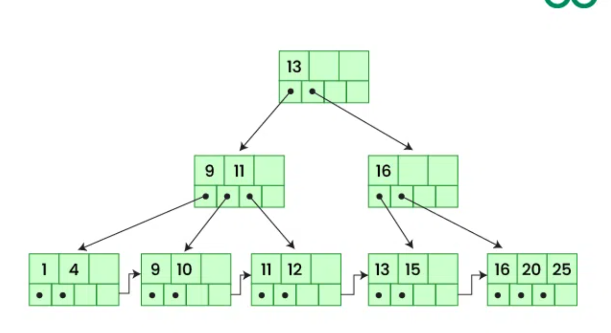
Sumber: geeksforgeeks.com


## Aplikasi/Implementasi dari B-Tree dan B+ Tree

### Database Management System

`B-Tree` dan `B+ Tree` banyak digunakan pada sistem manajemen basis data sebagai struktur index. Index berfungsi seperti daftar penunjuk yang membantu database menemukan baris data tanpa harus membaca seluruh tabel.

Pada database relasional, index berbasis  `B-Tree` digunakan untuk mempercepat query dengan kondisi pencarian tertentu. Misalnya, query yang mencari data berdasarkan `id`, `tanggal`, `nama`, atau rentang nilai dapat diproses lebih cepat jika kolom tersebut memiliki index.

B+ Tree sangat sesuai untuk database karena banyak operasi database tidak hanya mencari satu nilai, tetapi juga mengambil rentang data. Contohnya adalah pencarian transaksi dalam rentang tanggal, pencarian produk dalam rentang harga, atau pengambilan data yang harus diurutkan berdasarkan kolom tertentu.

### Sistem Basis Data Komersial

 `B-tree` telah menjadi tulang punggung sistem penyimpanan data modern yang ditunjukkan oleh adopsinya yang luas di berbagai platform produksi skala besar. Banyak sistem basis data dunia nyata telah mendukung kompresi `B-tree`, di antaranya DB2, MySQL (MyISAM), dan MongoDB WiredTiger 

Masing-masing sistem mengimplementasikan pendekatan kompresi yang berbeda sesuai kebutuhan arsitekturnya.

- IBM DB2 menggunakan varian prefix compression di mana setiap kunci direpresentasikan menggunakan pasangan (prefix, suffix). DB2 mengidentifikasi subset kunci dengan prefix yang sama dan hanya menyimpan suffix bytes dari kunci tersebut, sementara prefix disimpan hanya sekali. DB2 juga memiliki dua heuristik lanjutan bernama Prefix Merge dan Prefix Expand yang bekerja ketika halaman index hampir penuh, dengan memilih opsi yang memberikan penghematan ruang lebih besar.
- MongoDB WiredTiger menggunakan pendekatan delta-encoding, di mana setiap kunci hanya menyimpan suffix key bytes dan jumlah prefix bytes yang sama dengan kunci sebelumnya. Kunci pertama dalam node disimpan secara penuh, dan kunci berikutnya disimpan dengan membandingkannya terhadap kunci sebelumnya untuk mengidentifikasi prefix yang sama. WiredTiger juga mengimplementasikan dua teknik tambahan yaitu Best Prefix Group dan Roll-forward Distance Control untuk mempercepat proses dekompresi.
- MySQL MyISAM menggunakan representasi yang mirip dengan WiredTiger dalam hal delta-encoding, namun dengan perbedaan signifikan pada teknik pencariannya. MyISAM menggunakan sequential search yang dimulai dari awal halaman, sehingga menghilangkan kebutuhan key instantiation karena setiap kunci dapat dibangun langsung dari kunci sebelumnya.
- SAP HANA mengadopsi konsep PkB-Tree dan menggunakan variannya yang dikenal sebagai CPB-tree, yang menunjukkan bahwa pendekatan partial-key juga menemukan jalannya ke dalam sistem enterprise berskala besar.
  
### In - Memory Database

Selain sistem berbasis disk, `B-Tree` juga menjadi pilihan dominan pada sistem basis data berbasis memori. Walaupun data berada di memori utama dan aksesnya lebih cepat dibandingkan disk, struktur index tetap dibutuhkan agar pencarian tidak dilakukan secara linear. Microsoft's in-memory database Hekaton menggunakan Bw-tree, SAP's main-memory database HANA menggunakan CPB+-tree yaitu compressed prefix B+tree, sementara H-store juga menggunakan B-tree. 

### Kompresi Index

Dalam sistem database besar, index dapat menggunakan ruang penyimpanan yang sangat besar. Oleh karena itu, beberapa sistem menerapkan kompresi pada `B-Tree` atau `B+ Tree`. Teknik seperti prefix compression, suffix compression, delta encoding, dan Head+Tail Compression digunakan untuk mengurangi ukuran key di dalam node.

Teknik kompresi dapat meningkatkan efisiensi ruang dan dalam beberapa kondisi juga meningkatkan performa pencarian. Namun, teknik kompresi juga dapat menambah overhead karena sistem perlu melakukan proses dekompresi atau rekonstruksi key.

Dengan demikian, kompresi index memiliki trade-off. Di satu sisi, kompresi dapat menghemat ruang dan menurunkan tinggi tree. Di sisi lain, kompresi tertentu dapat memperlambat operasi insert atau search jika proses dekompresinya terlalu berat.

## Keunggulan dan Kekurangan

### Keunggulan B-Tree

`B-Tree` memiliki struktur yang seimbang sehingga performa pencarian tetap stabil. Karena satu node dapat menyimpan banyak key, tinggi tree menjadi lebih rendah dibandingkan Binary Search Tree. Hal ini membuat `B-Tree` cocok untuk sistem yang perlu mengakses data dalam jumlah besar.

`B-Tree` juga fleksibel karena data dapat disimpan pada internal node maupun leaf node. Dalam beberapa kasus, pencarian dapat selesai lebih cepat jika data ditemukan pada internal node tanpa harus turun sampai leaf.

### Kekurangan B-Tree

`B-Tree` kurang optimal untuk range query dibandingkan `B+ Tree`. Hal ini karena data tidak selalu tersusun hanya pada leaf dan leaf tidak selalu saling terhubung. Jika sistem perlu membaca banyak data secara berurutan, traversal pada `B-Tree` dapat menjadi lebih rumit.

Selain itu, implementasi delete pada `B-Tree` relatif kompleks. Sistem perlu menangani berbagai kasus seperti peminjaman key dari sibling, penggabungan node, dan pembaruan struktur parent.

### Keunggulan B+ Tree

`B+ Tree` sangat unggul untuk range query dan sequential access. Karena seluruh data berada pada leaf node dan leaf saling terhubung, sistem dapat membaca data secara berurutan dengan mudah setelah posisi awal ditemukan.

`B+ Tree `juga membuat internal node lebih ringan karena hanya berisi index. Hal ini memungkinkan fan-out lebih besar, sehingga tinggi tree dapat lebih rendah. Dalam konteks database, karakteristik ini sangat menguntungkan karena dapat mengurangi jumlah akses halaman.

### Kekurangan B+ Tree

Kekurangan `B+ Tree` adalah pencarian satu nilai harus selalu mencapai leaf node. Berbeda dengan `B-Tree`, pencarian tidak dapat berhenti di internal node karena internal node hanya menyimpan index.

Selain itu, `B+ Tree` membutuhkan pointer tambahan antar-leaf. Pointer ini memberikan keuntungan besar untuk sequential access, tetapi juga menambah kompleksitas implementasi, terutama saat insertion dan deletion menyebabkan split atau merge pada leaf.

### Keunggulan B-Tree dan B+ Tree Berdasarkan Optimasi Kompresi

Selain keunggulan struktural dasar, `B-Tree` dan `B+ Tree` juga dapat dioptimalkan menggunakan teknik kompresi indeks. Salah satu teknik kompresi indeks, Head+Tail Compression, mampu meningkatkan performa pencarian sebesar 25% hingga 120% dibandingkan B-Tree yang tidak dikompresi. Keunggulan ini terjadi karena proses pencarian dapat dilakukan langsung pada struktur indeks yang telah dikompresi tanpa perlu melakukan dekompresi terlebih dahulu.

Optimasi kompresi juga dapat meningkatkan performa insert. Beberapa teknik seperti Head Compression, Tail Compression, dan Head+Tail Compression mampu memberikan peningkatan performa insert sekitar 10% hingga 30%. Selain itu, teknik kompresi tertentu dapat menghemat ruang penyimpanan dengan compression ratio sekitar 1,2× hingga 3,5×, sehingga lebih banyak key dapat disimpan dalam satu halaman indeks.

Pada `B+ Tree`, keunggulan range query tetap menjadi salah satu aspek paling penting. Karena seluruh data berada di leaf node yang saling terhubung, sistem dapat melakukan pembacaan data secara berurutan dengan lebih efisien. Dalam konteks kompresi, Tail Compression juga mendukung range query dengan baik karena tidak membutuhkan proses dekompresi selama pemindaian data.

### Batasan B-Tree dan B+ Tree Berdasarkan Optimasi Kompresi

Meskipun kompresi dapat meningkatkan performa dan menghemat ruang, tidak semua teknik kompresi selalu memberikan hasil yang lebih baik. Teknik berbasis delta encoding seperti WiredTiger dan MyISAM dapat menimbulkan overhead dekompresi. Pada WiredTiger, sebagian besar waktu insert dapat habis untuk proses dekompresi, sehingga performanya dapat lebih rendah dibandingkan `B-Tree` tanpa kompresi.

Selain itu, efektivitas kompresi sangat bergantung pada karakteristik data. Dataset seperti URL atau teks yang memiliki banyak kesamaan prefix biasanya lebih mudah dikompresi, sedangkan data numerik dengan variasi prefix rendah dapat menghasilkan penghematan ruang yang lebih kecil. Ukuran halaman yang terlalu besar juga tidak selalu meningkatkan performa karena ketika tinggi tree sudah tidak dapat dikurangi lagi, biaya pencarian di dalam node justru dapat meningkat.

Beberapa varian seperti `PkB-tree` juga memiliki keterbatasan tertentu. `PkB-tree` lebih sesuai untuk mengurangi CPU cache miss pada sistem berbasis memori, tetapi kurang optimal untuk sistem berbasis disk karena dapat mengurangi locality dan menyebabkan range query membutuhkan lebih banyak operasi I/O.

## Perbandingan B Tree dan B+ Tree Secara Teori

### Karakteristik B Tree
`B-Tree` adalah balanced multiway search tree yang dapat menyimpan banyak key dalam satu node. Struktur ini dirancang agar tinggi tree tetap rendah sehingga proses pencarian data dapat dilakukan dengan efisien. Berdasarkan paper _On the histories of B-trees_, seluruh leaf pada `B-Tree` berada pada level yang sama untuk menjaga keseimbangan tree. `B-Tree` dapat memiliki banyak child. Jumlah maksimum child biasanya ditentukan oleh order atau degree dari tree. Semakin besar order `B-Tree`, semakin banyak key yang dapat disimpan dalam satu node dan semakin rendah tinggi tree yang terbentuk.

Karakteristik utama `B-Tree`:
- Data dapat disimpan pada internal node maupun leaf node
- Semua leaf berada pada level yang sama
- Struktur tree selalu seimbang
- Cocok digunakan pada sistem database dan file system

Contoh Struktur `B-Tree`:

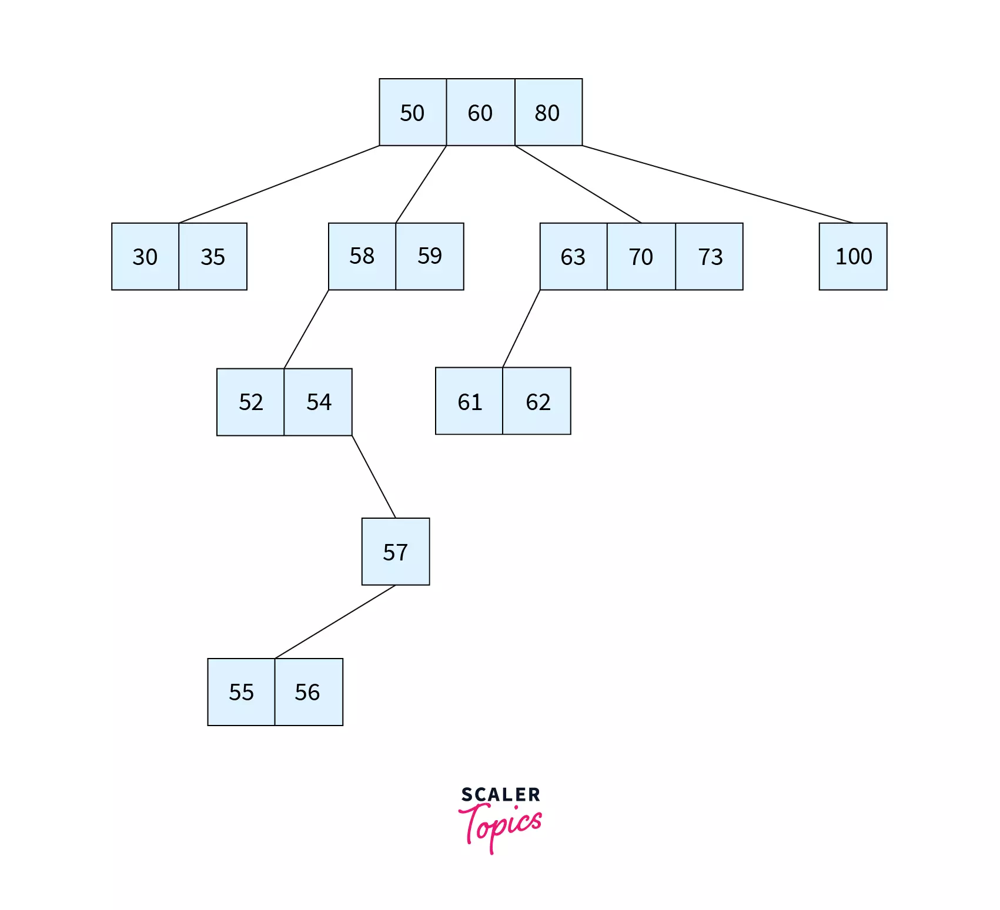
Sumber: Scaler Topics

Pada gambar di atas, node paling atas `[50 60 80]` merupakan `root node`. Root tersebut memiliki beberapa child node yang menyimpan rentang nilai tertentu. Misalnya:

- node `[30 35]` menyimpan nilai kurang dari 50,
- node `[58 59]` menyimpan nilai di antara 50 dan 60,
- node `[63 70 73]` menyimpan nilai di antara 60 dan 80,
- dan node `[100]` menyimpan nilai lebih besar dari 80.

Pada `B-Tree`, data dapat disimpan baik pada internal node maupun leaf node. Key di dalam setiap node disusun secara terurut. Urutan ini digunakan untuk menentukan child mana yang harus ditelusuri ketika sistem melakukan pencarian.

Struktur `B-Tree` selalu menjaga tree tetap seimbang sehingga pencarian data dapat dilakukan dengan stabil dan efisien. Selain itu, key pada setiap node tersusun secara terurut sehingga mempermudah proses search, insert, dan delete. Karena keunggulan tersebut, `B-Tree` banyak digunakan pada sistem database dan file system modern.

### Karakteristik B+ Tree

`B+ Tree` merupakan pengembangan dari `B-Tree` yang dirancang untuk meningkatkan efisiensi pencarian dan pengelolaan data pada sistem database modern. Perbedaan utama antara `B-Tree` dan `B+ Tree` terletak pada cara penyimpanan data. Pada `B+ Tree`, internal node hanya digunakan sebagai index atau penunjuk arah pencarian, sedangkan seluruh data disimpan pada leaf node.

Berikut adalah ilustrasi dari `B+ Tree`:

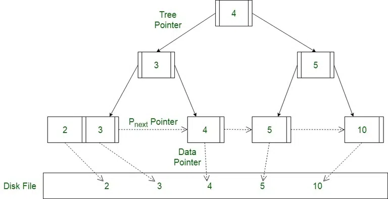
Sumber: geeksforgeeks.com

Karakteristik utama B+ Tree:

- Internal node hanya menyimpan index
- Seluruh data berada pada leaf node
- Leaf node saling terhubung menggunakan linked list
- Sangat efisien untuk sequential access dan range query

Contoh struktur `B+ Tree`: 

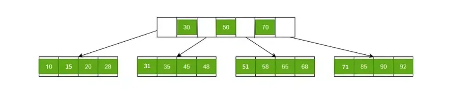
Sumber: geeksforgeeks.com

Pada gambar di atas, root node berisi key `[30, 50, dan 70]` yang berfungsi sebagai index atau penunjuk arah pencarian. Di bawahnya terdapat beberapa leaf node yang menyimpan data, seperti:
- `[10 15 20 28]`
- `[31 35 45 48]`
- `[51 58 65 68]`
- `[71 85 90 92]`
  
Sebagai contoh, untuk mencari nilai 58, proses pencarian dilakukan sebagai berikut:
1) Pencarian dimulai dari root node.
2) Karena 58 lebih besar dari 50 tetapi lebih kecil dari 70, maka pencarian diarahkan ke child node ketiga.
3) Sistem kemudian menuju leaf node `[51 58 65 68]`.
4) Nilai 58 ditemukan pada leaf node tersebut.

### Perbandingan Utama

Perbedaan utama antara `B-Tree` dan `B+ Tree` secara teori terletak pada cara keduanya menempatkan data, mengarahkan pencarian, dan mendukung akses berurutan. `B-Tree` lebih umum sebagai struktur search tree yang menyimpan key di berbagai level node. Sementara itu, `B+ Tree` lebih diarahkan sebagai struktur indexing database, dengan pemisahan yang lebih tegas antara node indeks dan node penyimpan data.

Dalam paper _On the histories of B-trees_, `B-Tree` dijelaskan sebagai search tree dengan aturan bahwa setiap node, kecuali root, memiliki jumlah key dalam batas tertentu. Untuk B-Tree berorde `2m + 1`, setiap node menyimpan minimal `m` key dan maksimal `2m` key, sedangkan root dapat memiliki jumlah key yang lebih fleksibel selama tidak melebihi batas maksimum.

`B+ Tree` juga merupakan self-balancing tree yang menjaga data tetap terurut dan mendukung operasi search, sequential access, insertion, dan deletion secara efisien. Paper _A B+-Tree-Based Indexing and Storage of Numerical Records in School Databases_ menjelaskan bahwa `B+ Tree` banyak digunakan untuk indexing nilai numerik pada data store berbasis blok karena strukturnya cocok dengan cara kerja database dan secondary storage. `B+ Tree` memusatkan penyimpanan data aktual pada leaf node, sedangkan internal node lebih berperan sebagai indeks atau penunjuk arah pencarian.

#### Perbedaan Penyimpanan Key dan Data
Pada `B-Tree`, key dapat tersimpan di internal node maupun leaf node. Karena key dapat muncul di berbagai level, pencarian bisa saja selesai sebelum mencapai leaf. Jika key yang dicari ditemukan di internal node, proses pencarian dapat berhenti di sana.

Pada `B+ Tree`, internal node hanya berfungsi sebagai indeks navigasi. Data atau record pointer disimpan pada leaf node. Karena itu, pencarian pada `B+ Tree` secara umum diarahkan sampai ke leaf node, sebab leaf adalah tempat data aktual berada.

| Aspek | B-Tree | B+ Tree |
|---|---|---|
| Tempat penyimpanan key | Internal node dan leaf node | Internal node dan leaf node, tetapi internal node berfungsi sebagai indeks |
| Tempat penyimpanan data/record | Dapat berada di berbagai node | Dipusatkan pada leaf node |
| Fungsi internal node | Menyimpan key sekaligus membantu pencarian | Menjadi penunjuk arah menuju leaf |
| Kemungkinan pencarian selesai di internal node | Ada | Umumnya tidak, karena data aktual berada di leaf |

#### Perbedaan Struktur Leaf Node
  
Pada B-Tree, leaf node tetap menjadi bagian dari struktur pencarian, tetapi tidak memiliki peran khusus sebagai satu-satunya tempat data. Leaf node pada B-Tree menyimpan key seperti node lainnya, dan seluruh leaf dijaga agar berada pada level yang sama.

Pada B+ Tree, leaf node memiliki peran yang lebih penting. Paper _A B+-Tree-Based Indexing and Storage of Numerical Records in School Databases_ menjelaskan bahwa semua entry berada di leaf node dan setiap leaf node terhubung dengan leaf node berikutnya. Hubungan antar-leaf ini membentuk jalur horizontal yang memungkinkan sistem melakukan akses berurutan tanpa harus kembali naik ke root.     Perbedaan ini menyebabkan B+ Tree lebih cocok untuk operasi yang membutuhkan pembacaan data secara berurutan, seperti membaca semua data dalam rentang nilai tertentu.

#### Perbedaan Logika Search

Pada B-Tree, pencarian dimulai dari root. Key dalam node dibandingkan dengan key yang dicari. Jika key ditemukan di node tersebut, pencarian selesai. Jika tidak, pencarian dilanjutkan ke child yang sesuai dengan interval nilai. Karena key dapat berada pada internal node, B-Tree memiliki kemungkinan pencarian yang lebih cepat untuk key tertentu. Namun, ketika data tersebar di internal node dan leaf node, proses traversal berurutan tidak seefisien B+ Tree. 

Pada B+ Tree, pencarian juga dimulai dari root. Namun root dan internal node digunakan terutama untuk memilih jalur menuju leaf node. Setelah leaf node yang sesuai ditemukan, barulah sistem mengecek entry yang berisi key dan pointer ke record. Keunggulan B+ Tree akan terasa ketika pencarian dilakukan dalam bentuk range query atau sequential access.

#### Perbedaan Sequential Access dan Range Query

B+ Tree lebih unggul untuk sequential access dan range query. Penyebabnya adalah seluruh data berada di leaf node dan leaf node saling terhubung. Setelah sistem menemukan leaf pertama yang memenuhi batas awal pencarian, sistem dapat bergerak langsung ke leaf berikutnya melalui pointer antar-leaf.

Contohnya, jika database ingin mencari semua nilai antara `30` sampai `70`, B+ Tree cukup mencari leaf pertama yang berisi nilai awal, lalu bergerak secara horizontal melalui leaf node sampai batas akhir tercapai.

Pada B-Tree, range query tetap bisa dilakukan, tetapi prosesnya cenderung lebih kompleks karena data dapat tersebar di internal node dan leaf node. Traversal harus mempertimbangkan struktur pohon secara lebih menyeluruh, bukan hanya mengikuti linked leaf.

#### Perbedaan Insertion dan Splitting

Paper _On the histories of B-trees_ menjelaskan bahwa insertion dilakukan dengan menempatkan key baru ke leaf yang sesuai. Pada `B-Tree`, jika leaf masih berada dalam batas kapasitas, proses selesai. Jika node melebihi kapasitas, node tersebut di-split. Median key dipindahkan ke parent, sedangkan key yang lebih kecil dan lebih besar dipisahkan ke dua node baru. Jika parent juga penuh, proses split dapat naik terus sampai root. Tinggi B-Tree hanya bertambah ketika root mengalami split dan root baru dibuat di atas root lama.


Paper _A B+-Tree-Based Indexing and Storage of Numerical Records in School Databases_ menjelaskan bahwa insertion terdiri dari tiga tahap utama: mencari leaf yang sesuai, menyisipkan elemen, lalu melakukan balancing atau splitting jika diperlukan. Karena data aktual berada di leaf, insertion selalu diarahkan ke leaf node. Pada `B+ Tree`, jika leaf tidak penuh, key dimasukkan secara terurut. Jika leaf penuh, leaf harus dipecah dan perubahan struktur indeks dapat naik ke internal node. Dengan kata lain, `B+ Tree` juga memakai splitting untuk menjaga keseimbangan, tetapi fokusnya tetap menjaga leaf sebagai pusat penyimpanan data.

#### Perbedaan Efisiensi Teoretis

Secara kompleksitas asimtotik, `B-Tree` dan `B+ Tree` sama-sama mendukung operasi dasar seperti search, insert, dan delete dalam waktu sekitar `O(log n)`, karena keduanya menjaga tinggi pohon tetap rendah dan seimbang.

Namun, efisiensi praktis dan karakter penggunaannya berbeda. `B-Tree` dapat lebih cepat untuk pencarian key tertentu jika key ditemukan di internal node. Akan tetapi,` B+ Tree` lebih konsisten untuk database karena semua pencarian data aktual berakhir di leaf node. Selain itu, internal node `B+ Tree` dapat lebih fokus menyimpan indeks, sehingga fan-out dapat lebih besar dan tinggi pohon dapat tetap rendah.

Untuk range query dan traversal berurutan, `B+ Tree` lebih unggul karena linked leaf node memungkinkan akses horizontal yang efisien.

#### Ringkasan Perbedaan

| Aspek Teoretis | B-Tree | B+ Tree |
|---|---|---|
| Jenis struktur | Balanced multiway search tree | Self-balancing indexing tree |
| Keseimbangan | Semua leaf berada pada level yang sama | Semua leaf berada pada level yang sama |
| Penyimpanan data | Data/key dapat berada di internal node dan leaf node | Data aktual atau record pointer dipusatkan di leaf node |
| Fungsi internal node | Menyimpan key dan mengarahkan pencarian | Menjadi indeks navigasi |
| Fungsi leaf node | Menyimpan key seperti node lain | Menjadi pusat penyimpanan data dan entry |
| Hubungan antar-leaf | Umumnya tidak menjadi fitur utama | Leaf node saling terhubung |
| Pencarian satu nilai | Bisa selesai di internal node | Umumnya berakhir di leaf node |
| Range query | Bisa dilakukan, tetapi traversal lebih kompleks | Lebih efisien karena leaf saling terhubung |
| Sequential access | Tidak seoptimal B+ Tree | Sangat cocok |
| Orientasi desain | Struktur pencarian seimbang secara umum | Indexing database dan block-based storage |
| Kelebihan utama | Struktur lebih langsung untuk pencarian key | Sangat kuat untuk indexing, range query, dan traversal data |
| Konsekuensi utama | Data tersebar di beberapa level | Data terkonsentrasi di leaf, internal node lebih ringan sebagai indeks |

## Analisis Kompleksitas Berdasarkan Struktur Tree

Misalkan `n` adalah jumlah key atau record yang disimpan, `t` adalah minimum degree, `h` adalah tinggi tree, dan `k` adalah jumlah data yang dibaca dalam operasi range query. Pada `B-Tree` dan `B+ Tree`, struktur tree dijaga tetap seimbang sehingga semua jalur pencarian memiliki panjang yang relatif sama. Karena setiap node dapat memiliki banyak child, tinggi tree menjadi jauh lebih rendah dibandingkan tree biner biasa.

Secara umum, tinggi `B-Tree` dan `B+ Tree` berada pada orde logaritmik terhadap jumlah data, yaitu sekitar `O(log_t n)`. Semakin besar fanout atau jumlah percabangan dalam satu node, semakin kecil tinggi tree. Akibatnya, jumlah node yang perlu dilewati dalam operasi search, insert, dan delete juga semakin sedikit.

| Operasi | B-Tree | B+ Tree | Penjelasan |
|---|---:|---:|---|
| Search exact | `O(log_t n)` | `O(log_t n)` | Keduanya melakukan penelusuran dari root menuju posisi key yang dicari. Pada `B-Tree`, pencarian dapat berhenti lebih awal jika key ditemukan di internal node. Pada `B+ Tree`, pencarian umumnya tetap diarahkan sampai leaf node karena data aktual atau record pointer berada di leaf. |
| Insert | `O(log_t n)` | `O(log_t n)` | Keduanya harus mencari leaf node yang sesuai terlebih dahulu. Setelah itu, key disisipkan secara terurut. Jika node penuh, split dapat terjadi dan dapat merambat ke parent hingga root. Namun, jumlah level yang mungkin terkena split tetap dibatasi oleh tinggi tree. |
| Delete | `O(log_t n)` | `O(log_t n)` | Keduanya perlu mencari key yang akan dihapus, lalu memperbaiki struktur jika terjadi underflow. Perbaikan dapat berupa redistribution atau borrowing dari sibling, serta merge dengan sibling. Proses perbaikan ini dapat merambat ke parent, tetapi tetap dibatasi oleh tinggi tree. |
| Range query | `O(log_t n + k)` | `O(log_t n + k)` | Secara asimtotik, keduanya dapat membaca data dalam suatu rentang dengan mencari posisi awal terlebih dahulu, lalu mengambil `k` data yang sesuai. Namun, secara praktik `B+ Tree` lebih efisien dan lebih natural untuk range query karena semua data berada pada leaf node yang saling terhubung. Pada `B-Tree`, data dapat tersebar di internal node dan leaf node sehingga traversal range lebih kompleks. |
| Space | `O(n)` | `O(n)` | Keduanya membutuhkan ruang yang bertambah secara linear terhadap jumlah data. `B+ Tree` dapat memiliki overhead tambahan karena separator key juga muncul di internal node dan leaf node memiliki pointer horizontal ke leaf berikutnya. Namun, internal node pada `B+ Tree` biasanya dapat memiliki fanout lebih besar karena tidak menyimpan data aktual. |

Jika analisis dilakukan pada level asimtotik dan `t` dianggap sebagai konstanta, maka kompleksitas `O(log_t n)` sering disederhanakan menjadi `O(log n)`. Namun, dalam konteks database dan file system, nilai `t` atau fanout sangat penting karena berpengaruh langsung terhadap tinggi tree dan jumlah akses halaman disk.

Perbedaan utama antara `B-Tree` dan `B+ Tree` tidak terlalu terlihat dari notasi Big-O, karena operasi utamanya sama-sama berada pada orde logaritmik. Perbedaannya lebih terasa pada faktor praktis seperti jumlah akses node, pola akses disk, dan efisiensi traversal berurutan.

Pada `B-Tree`, exact search bisa lebih cepat dalam beberapa kasus karena key dapat ditemukan pada internal node tanpa harus turun sampai leaf. Namun, keuntungan ini tidak selalu dominan, terutama jika data berukuran besar dan akses disk menjadi faktor utama.

Pada `B+ Tree`, exact search biasanya harus mencapai leaf node, tetapi struktur internal node yang lebih ringan dapat menghasilkan fanout lebih besar dan tinggi tree yang lebih rendah. Selain itu, `B+ Tree` jauh lebih unggul untuk range query dan sequential access karena seluruh data berada pada leaf node dan leaf node saling terhubung secara berurutan.

Dengan demikian, secara teori kompleksitas `B-Tree` dan `B+ Tree` terlihat mirip, tetapi secara struktural keduanya memiliki keunggulan yang berbeda. `B-Tree` lebih fleksibel untuk pencarian key tunggal karena data dapat berada di internal node maupun leaf node. Sebaliknya, `B+ Tree` lebih cocok untuk sistem database modern yang sering membutuhkan range query, sequential scan, dan akses data berbasis indeks dalam jumlah besar.

## Potensi Pengembangan ke Depan

### Sistem Kompresi Adaptif
Tidak ada satu teknik kompresi yang selalu optimal untuk semua jenis data. Oleh karena itu, salah satu arah pengembangan yang menjanjikan adalah sistem kompresi adaptif yang dapat menganalisis karakteristik data dan secara otomatis memilih strategi kompresi yang paling sesuai.

### Pengembangan PkB-tree untuk Penyimpanan Modern
Meskipun awalnya dirancang untuk mengurangi cache miss pada memori utama, konsep partial-key pada PkB-tree berpotensi dikembangkan lebih lanjut agar sesuai dengan karakteristik perangkat penyimpanan modern seperti NVMe SSD.

### Integrasi dengan Learned Index
Perkembangan machine learning membuka peluang munculnya learned index yang memprediksi posisi data dalam struktur indeks. Integrasi learned index dengan B-tree/B+ tree yang telah dioptimalkan melalui kompresi dapat menghasilkan struktur indeks yang lebih cepat dan lebih hemat ruang dibandingkan pendekatan konvensional.

### Optimasi untuk Large Page Size
Masih diperlukan kebutuhan optimasi tambahan untuk ukuran halaman yang besar. Pengembangan algoritma yang mampu menyeimbangkan hubungan antara ukuran halaman, tinggi pohon, dan biaya pencarian dalam node menjadi salah satu area penelitian yang masih terbuka.

### Optimasi pada Composite Key
Basis data relasional modern sering menggunakan composite key yang terdiri atas beberapa kolom sekaligus. Pengembangan teknik kompresi yang secara khusus dirancang untuk memanfaatkan karakteristik composite key dapat meningkatkan efisiensi ruang dan performa `B-Tree`/`B+ tree` pada aplikasi dunia nyata.

### Integrasi dengan Learned Index
Perkembangan machine learning membuka peluang munculnya learned index yang memprediksi posisi data dalam struktur indeks. Integrasi learned index dengan `B-Tree`/`B+ Tree` yang telah dioptimalkan melalui kompresi dapat menghasilkan struktur indeks yang lebih cepat dan lebih hemat ruang dibandingkan pendekatan konvensional. Namun, pendekatan ini masih memiliki tantangan, terutama pada proses update data, concurrency control, dan kestabilan performa ketika pola data berubah.

### Pengembangan PkB-tree untuk Penyimpanan Modern
Meskipun awalnya dirancang untuk mengurangi cache miss pada memori utama, konsep partial-key pada PkB-tree berpotensi dikembangkan lebih lanjut agar sesuai dengan karakteristik perangkat penyimpanan modern seperti SSD dan NVMe SSD. Perubahan teknologi penyimpanan membuat desain `B-Tree`/`B+ Tree` tidak hanya perlu mempertimbangkan pengurangan akses disk, tetapi juga locality, bandwidth, latency, dan efisiensi akses halaman pada media penyimpanan modern.

## Hasil Implementasi

Implementasi B-Tree dan B+ Tree pada bahasa java dapat dilihat pada file berikut:
- [Program B-Tree](BTreeProgram.java)
- [Program B+ Tree](BPlusTreeProgram.java)

### Overview Program
Program `B-Tree` dan `B+ Tree` sama-sama menyediakan operasi dasar untuk mengelola sekumpulan key bertipe `int`. Pengguna dapat memasukkan key, mencari key, menghapus key, menampilkan isi tree, melakukan pencarian dalam rentang nilai, melihat key secara terurut, dan menjalankan benchmark sederhana.

Kedua program menggunakan konsep `minimumDegree` atau derajat minimum `t`. Nilai ini menentukan kapasitas node, yaitu jumlah maksimum key sebesar `2t - 1` dan batas minimum key umum sebesar `t - 1`. Semakin besar nilai `t`, semakin banyak key yang dapat ditampung dalam satu node, sehingga tinggi tree cenderung lebih rendah, tetapi operasi di dalam node dapat melibatkan lebih banyak elemen.

Secara umum, kedua program memiliki tujuan untuk menunjukkan bagaimana tree tetap seimbang walaupun terjadi insert dan delete berulang. Kedua, program memperlihatkan perbedaan implementasi `B-Tree` dan `B+ Tree`, terutama pada penyimpanan data, traversal, dan range search. Ketiga, program menyediakan menu interaktif sehingga struktur tree dapat diuji dengan input manual maupun benchmark.

### Ringkasan Perbedaan Implementasi B-Tree dan B+ Tree dalam Program

| Aspek | B-Tree | B+ Tree |
|---|---|---|
| Penyimpanan key | Key disimpan di internal node dan leaf node. | Key efektif disimpan di leaf node, sedangkan internal node menyimpan separator. |
| Struktur node | Menggunakan array `keys` dan array `children`. | Menggunakan `List<Integer>` untuk key dan `List<Node>` untuk children. |
| Range search | Menggunakan traversal DFS bersyarat. | Menggunakan leaf chain dari leaf awal sampai batas atas. |
| Traversal sorted | Menggunakan inorder traversal. | Menggunakan linked list antar leaf. |
| Split leaf | Middle key naik ke parent. | Key pertama leaf kanan menjadi separator parent. |
| Delete | Menggunakan predecessor, successor, borrowing, dan merge. | Menghapus di leaf, lalu rebalance leaf/internal dengan borrowing atau merge. |
| Benchmark | Menguji insert, search, range search, delete, dan height. | Menguji operasi yang sama dengan tambahan karakteristik leaf chain. |

Perbedaan paling penting pada implementasi ini terletak pada cara range search dilakukan. `B-Tree` harus melakukan traversal dari subtree ke subtree karena data dapat tersebar di internal dan leaf node. `B+ Tree` dapat memulai dari leaf pertama yang relevan lalu berjalan melalui pointer `next`, sehingga akses berurutan lebih natural.

### Menu dan Fitur Program

edua program menyediakan menu yang hampir sama. Menu dibuat agar pengguna dapat mencoba operasi tree tanpa perlu mengubah source code.

| Nomor Menu | Fitur | Fungsi Umum |
|---|---|---|
| 1 | Insert key(s) | Menambahkan satu atau banyak key sekaligus. |
| 2 | Search key | Mengecek apakah suatu key ada di tree. |
| 3 | Delete key | Menghapus key jika ditemukan. |
| 4 | Range search | Mengambil key dalam interval `[low, high]`. |
| 5 | Display tree | Menampilkan struktur tree per level. |
| 6 | Show sorted keys | Menampilkan semua key secara terurut. |
| 7 | Benchmark | Menguji performa insert, search, range search, delete, dan height. |
| 0 | Exit | Keluar dari program. |

Fitur menu dipisahkan dari class tree utama. Artinya, class `BTree` dan `BPlusTree` menyimpan logika struktur data, sedangkan method seperti `handleInsert`, `handleSearch`, dan `handleDelete` menangani interaksi input-output pengguna.

### Progam B-Tree

#### Gambaran Umum Program B-Tree

`BTreeProgram` adalah program Java yang mengimplementasikan struktur data B-Tree dengan key bertipe integer. Program ini menggunakan nested class `BTree` sebagai struktur data utama, dan nested class `Node` sebagai representasi node dalam tree.

`B-Tree` pada program ini mempertahankan semua leaf pada level yang sama. Setiap node dapat menyimpan beberapa key sekaligus, sehingga tree tidak tumbuh terlalu tinggi seperti binary search tree biasa. Struktur ini cocok untuk menjelaskan konsep indeks karena pencarian dilakukan dengan membandingkan key dalam node lalu turun ke child yang sesuai.


#### Penjelasan Implementasi pada Kode

- Class
``` java
public class BTreeProgram {
    public static class BTree {
        private static class Node { ... }
        
        private Node root;
        private final int minimumDegree;
        private int size;
    }
    
    public static void main(String[] args) { ... }
}
 ```

 Struktur kelas tersebut menunjukkan bahwa program utama `BTreeProgram` berisi kelas `BTree` sebagai pengelola struktur pohon, sedangkan kelas `Node` digunakan sebagai representasi setiap simpul dalam B-Tree yang menyimpan key, child, jumlah key aktif, dan penanda apakah node tersebut leaf.

`BPlusTreeProgram` adalah program Java yang mengimplementasikan B+ Tree dengan key dan value bertipe integer. Pada implementasi ini, value yang disimpan sama dengan key karena method insert memanggil `insert(root, key, key)`. Dalam konteks indeks database, value dapat dibayangkan sebagai record pointer, tetapi pada program ini value disederhanakan menjadi integer yang sama dengan key.

B+ Tree pada program ini menggunakan dua jenis node, yaitu `InternalNode` dan `LeafNode`. Internal node menyimpan separator dan child pointer, sedangkan leaf node menyimpan key-value dan pointer `next` menuju leaf berikutnya. Pointer `next` inilah yang membuat range search dan traversal sorted lebih efisien secara konseptual

 - Komponen Node B-Tree
```java
private static class Node {
    int keyCount;           // Jumlah keys aktif dalam node
    int[] keys;             // Array menyimpan keys (ukuran: 2t-1)
    Node[] children;        // Array menyimpan pointer children (ukuran: 2t)
    boolean leaf;           // Flag apakah node adalah leaf
    
    Node(int minimumDegree, boolean leaf) {
        this.leaf = leaf;
        this.keys = new int[2 * minimumDegree - 1];
        this.children = new Node[2 * minimumDegree];
        this.keyCount = 0;
    }
}
```


Pada class `Node`, array `keys` berukuran `2t - 1` karena satu node `B-Tree` dengan minimum degree `t` maksimal dapat menyimpan `2t - 1` key, sedangkan array `children` berukuran `2t` karena node internal maksimal dapat memiliki `2t` child. `leaf` berguna sebagai flag untuk membedakan leaf node dari internal node

- Inisialisasi B-Tree
```java
public BTree(int minimumDegree) {
    if (minimumDegree < 2) {
        throw new IllegalArgumentException("Minimum degree must be at least 2");
    }
    this.minimumDegree = minimumDegree;
    this.root = new Node(minimumDegree, true);
    this.size = 0;
}
```

Root awal dibuat sebagai leaf kosong. Saat key mulai dimasukkan, root dapat berubah menjadi internal node jika root penuh dan harus di-split. Field `size` menyimpan jumlah key aktif yang berhasil dimasukkan, bukan jumlah node.

- B-Tree - Search
  
Fitur search digunakan untuk mengecek apakah sebuah key ada dalam tree. Search dimulai dari root, lalu membandingkan key target dengan key yang ada di node saat ini. Jika key ditemukan, method langsung mengembalikan node tersebut. Jika tidak ditemukan dan node masih memiliki child, pencarian turun ke child yang sesuai.

```java
public boolean search(int key) {
    return search(root, key) != null;
}

private Node search(Node node, int key) {
    int index = 0;
    while (index < node.keyCount && key > node.keys[index]) {
        index++;
    }
    if (index < node.keyCount && key == node.keys[index]) {
        return node;
    }
    if (node.leaf) {
        return null;
    }
    return search(node.children[index], key);
}
```

Logika `while` mencari posisi pertama di mana key target tidak lebih besar dari key pada node. Jika key sama dengan elemen pada posisi tersebut, berarti key ditemukan. Jika tidak sama, posisi `index` menunjukkan child yang harus dikunjungi berikutnya.

Pada `B-Tree`, pencarian tidak selalu sampai leaf. Jika key berada di internal node, search berhenti di internal node tersebut. Hal ini berbeda dari `B+ Tree`, yang selalu mengarahkan pencarian ke leaf karena data efektif berada di leaf.

- B-Tree - Insert

Fitur insert menambahkan key baru sambil mempertahankan aturan kapasitas B-Tree. Program juga menolak duplikasi key dengan melakukan search terlebih dahulu. Jika key sudah ada, method mengembalikan `false` dan ukuran tree tidak berubah.

```java
public boolean insert(int key) {
    if (search(key)) {
        return false;
    }

    Node currentRoot = root;
    if (currentRoot.keyCount == 2 * minimumDegree - 1) {
        Node newRoot = new Node(minimumDegree, false);
        root = newRoot;
        newRoot.children[0] = currentRoot;
        splitChild(newRoot, 0, currentRoot);
        insertNonFull(newRoot, key);
    } else {
        insertNonFull(currentRoot, key);
    }
    size++;
    return true;
}
```
 Jika root sudah memiliki `2t - 1` key, root harus di-split terlebih dahulu agar tinggi tree dapat bertambah. Setelah root di-split, key baru dimasukkan ke node yang belum penuh melalui `insertNonFull`.

 - Insert ke Node yang Belum Penuh

Method `insertNonFull` menangani dua kasus. Jika node adalah leaf, key langsung disisipkan pada posisi yang menjaga urutan naik. Jika node adalah internal node, program mencari child yang sesuai, mengecek apakah child tersebut penuh, lalu melakukan split sebelum turun lebih jauh jika diperlukan.

```java
private void insertNonFull(Node node, int key) {
    int index = node.keyCount - 1;
    if (node.leaf) {
        while (index >= 0 && key < node.keys[index]) {
            node.keys[index + 1] = node.keys[index];
            index--;
        }
        node.keys[index + 1] = key;
        node.keyCount++;
        return;
    }

    while (index >= 0 && key < node.keys[index]) {
        index--;
    }
    index++;

    if (node.children[index].keyCount == 2 * minimumDegree - 1) {
        splitChild(node, index, node.children[index]);
        if (key > node.keys[index]) {
            index++;
        }
    }
    insertNonFull(node.children[index], key);
}
```

Strategi ini disebut top-down insertion. Program memastikan child yang akan dituruni tidak penuh sebelum proses rekursi dilanjutkan. Dengan cara ini, ketika insert sampai ke leaf, leaf tersebut sudah memiliki ruang untuk menerima key baru.

###Method `insertNonFull` menangani dua kasus. Jika node adalah leaf, key langsung disisipkan pada posisi yang menjaga urutan naik. Jika node adalah internal node, program mencari child yang sesuai, mengecek apakah child tersebut penuh, lalu melakukan split sebelum turun lebih jauh jika diperlukan.

```java
private void insertNonFull(Node node, int key) {
    int index = node.keyCount - 1;
    if (node.leaf) {
        while (index >= 0 && key < node.keys[index]) {
            node.keys[index + 1] = node.keys[index];
            index--;
        }
        node.keys[index + 1] = key;
        node.keyCount++;
        return;
    }

    while (index >= 0 && key < node.keys[index]) {
        index--;
    }
    index++;

    if (node.children[index].keyCount == 2 * minimumDegree - 1) {
        splitChild(node, index, node.children[index]);
        if (key > node.keys[index]) {
            index++;
        }
    }
    insertNonFull(node.children[index], key);
}
```

Strategi ini disebut top-down insertion. Program memastikan child yang akan dituruni tidak penuh sebelum proses rekursi dilanjutkan. Dengan cara ini, ketika insert sampai ke leaf, leaf tersebut sudah memiliki ruang untuk menerima key baru.

- B-Tree - Split Child

Split dilakukan ketika sebuah child penuh. Child penuh dibagi menjadi dua node, lalu key tengah naik ke parent. Node kiri menyimpan key yang lebih kecil, node kanan menyimpan key yang lebih besar, dan parent menerima separator baru.

```java
private void splitChild(Node parent, int index, Node fullChild) {
    Node rightChild = new Node(minimumDegree, fullChild.leaf);
    rightChild.keyCount = minimumDegree - 1;

    for (int j = 0; j < minimumDegree - 1; j++) {
        rightChild.keys[j] = fullChild.keys[j + minimumDegree];
    }

    if (!fullChild.leaf) {
        for (int j = 0; j < minimumDegree; j++) {
            rightChild.children[j] = fullChild.children[j + minimumDegree];
        }
    }

    fullChild.keyCount = minimumDegree - 1;

    for (int j = parent.keyCount; j >= index + 1; j--) {
        parent.children[j + 1] = parent.children[j];
    }
    parent.children[index + 1] = rightChild;

    for (int j = parent.keyCount - 1; j >= index; j--) {
        parent.keys[j + 1] = parent.keys[j];
    }
    parent.keys[index] = fullChild.keys[minimumDegree - 1];
    parent.keyCount++;
}
```

Pada split ini, key di posisi `minimumDegree - 1` menjadi key tengah yang naik ke parent. Key setelah posisi tengah disalin ke `rightChild`, sedangkan `fullChild` dipangkas agar hanya memiliki `minimumDegree - 1` key. Jika node yang di-split bukan leaf, child pointer bagian kanan juga dipindahkan ke `rightChild`

- B-Tree - Delete

Fitur delete menghapus key sambil memastikan setiap node tetap memenuhi batas minimum key. Program melakukan search lebih dahulu untuk memastikan key memang ada. Jika key tidak ditemukan, method mengembalikan `false` dan struktur tree tidak berubah.

```java
public boolean delete(int key) {
    if (!search(key)) {
        return false;
    }
    delete(root, key);
    if (root.keyCount == 0 && !root.leaf) {
        root = root.children[0];
    }
    size--;
    return true;
}
```

Setelah delete selesai, root dicek kembali. Jika root kosong tetapi bukan leaf, root diturunkan menjadi child pertamanya. Ini mencegah tree memiliki root kosong yang tidak diperlukan dan menjaga tinggi tree tetap minimal.

Recursive delete mencari posisi key dalam node. Jika key ditemukan di leaf, key langsung dihapus. Jika key ditemukan di internal node, program memakai strategi predecessor, successor, atau merge. Jika key belum ditemukan dan node bukan leaf, program memastikan child tujuan memiliki cukup key sebelum turun.

```java
private void delete(Node node, int key) {
    int index = findKeyIndex(node, key);

    if (index < node.keyCount && node.keys[index] == key) {
        if (node.leaf) {
            removeFromLeaf(node, index);
        } else {
            removeFromInternal(node, index);
        }
        return;
    }

    if (node.leaf) {
        return;
    }

    boolean keyMayBeInLastChild = index == node.keyCount;
    if (node.children[index].keyCount < minimumDegree) {
        fill(node, index);
    }

    if (keyMayBeInLastChild && index > node.keyCount) {
        delete(node.children[index - 1], key);
    } else {
        delete(node.children[index], key);
    }
}
```

Method `fill` adalah bagian penting dari delete. Sebelum turun ke child, program memastikan child tersebut memiliki minimal `t` key, bukan hanya `t - 1` key. Hal ini dilakukan agar proses delete di bawah tidak langsung menyebabkan underflow yang sulit ditangani dari bawah.

Jika key berada pada leaf, penghapusan dilakukan dengan menggeser semua key setelah posisi penghapusan ke kiri. Setelah shifting selesai, `keyCount` dikurangi satu.

```java
private void removeFromLeaf(Node node, int index) {
    for (int i = index + 1; i < node.keyCount; i++) {
        node.keys[i - 1] = node.keys[i];
    }
    node.keyCount--;
}
```

Operasi ini sederhana karena leaf tidak memiliki child yang harus dipindahkan. Yang perlu dijaga hanyalah urutan key dalam array dan jumlah key aktif pada node.

Jika key berada pada internal node, key tidak bisa langsung dihapus tanpa menjaga struktur subtree. Program menggunakan tiga strategi. Pertama, jika child kiri memiliki cukup key, key diganti dengan predecessor. Kedua, jika child kanan memiliki cukup key, key diganti dengan successor. Ketiga, jika kedua child tidak cukup, keduanya digabung lalu delete dilanjutkan pada node hasil merge.

```java
private void removeFromInternal(Node node, int index) {
    int key = node.keys[index];

    if (node.children[index].keyCount >= minimumDegree) {
        int predecessor = getPredecessor(node, index);
        node.keys[index] = predecessor;
        delete(node.children[index], predecessor);
    } else if (node.children[index + 1].keyCount >= minimumDegree) {
        int successor = getSuccessor(node, index);
        node.keys[index] = successor;
        delete(node.children[index + 1], successor);
    } else {
        merge(node, index);
        delete(node.children[index], key);
    }
}
```

Predecessor adalah key terbesar dari subtree kiri, sedangkan successor adalah key terkecil dari subtree kanan. Penggunaan predecessor atau successor menjaga urutan key tetap valid karena pengganti masih berada di antara semua key subtree kiri dan subtree kanan.

- B-Tree - Borrowing and Merge

Saat child yang akan dituruni kekurangan key, program memanggil `fill`. Method ini mencoba meminjam key dari sibling kiri, lalu sibling kanan. Jika tidak ada sibling yang dapat memberi key, child digabung dengan sibling.

```java
private void fill(Node node, int index) {
    if (index != 0 && node.children[index - 1].keyCount >= minimumDegree) {
        borrowFromPrevious(node, index);
    } else if (index != node.keyCount && node.children[index + 1].keyCount >= minimumDegree) {
        borrowFromNext(node, index);
    } else {
        if (index != node.keyCount) {
            merge(node, index);
        } else {
            merge(node, index - 1);
        }
    }
}
```

Borrowing dari sibling kiri dilakukan dengan rotasi melalui parent. Key parent turun ke child, lalu key terbesar sibling kiri naik ke parent. Jika node bukan leaf, child pointer yang sesuai juga ikut dipindahkan.

```java
private void borrowFromPrevious(Node node, int index) {
    Node child = node.children[index];
    Node sibling = node.children[index - 1];

    for (int i = child.keyCount - 1; i >= 0; i--) {
        child.keys[i + 1] = child.keys[i];
    }

    if (!child.leaf) {
        for (int i = child.keyCount; i >= 0; i--) {
            child.children[i + 1] = child.children[i];
        }
    }

    child.keys[0] = node.keys[index - 1];
    if (!child.leaf) {
        child.children[0] = sibling.children[sibling.keyCount];
    }
    node.keys[index - 1] = sibling.keys[sibling.keyCount - 1];

    child.keyCount++;
    sibling.keyCount--;
}
```

Borrowing dari sibling kanan bekerja dengan arah berlawanan. Key parent turun ke akhir child, lalu key terkecil sibling kanan naik ke parent. Setelah itu, key dan child pointer pada sibling kanan digeser ke kiri.

```java
private void borrowFromNext(Node node, int index) {
    Node child = node.children[index];
    Node sibling = node.children[index + 1];

    child.keys[child.keyCount] = node.keys[index];
    if (!child.leaf) {
        child.children[child.keyCount + 1] = sibling.children[0];
    }
    node.keys[index] = sibling.keys[0];

    for (int i = 1; i < sibling.keyCount; i++) {
        sibling.keys[i - 1] = sibling.keys[i];
    }

    if (!sibling.leaf) {
        for (int i = 1; i <= sibling.keyCount; i++) {
            sibling.children[i - 1] = sibling.children[i];
        }
    }

    child.keyCount++;
    sibling.keyCount--;
}
```

Merge menggabungkan child, key separator dari parent, dan sibling kanan menjadi satu node. Setelah merge, parent kehilangan satu key dan satu child pointer.

```java
private void merge(Node node, int index) {
    Node child = node.children[index];
    Node sibling = node.children[index + 1];

    child.keys[minimumDegree - 1] = node.keys[index];

    for (int i = 0; i < sibling.keyCount; i++) {
        child.keys[i + minimumDegree] = sibling.keys[i];
    }

    if (!child.leaf) {
        for (int i = 0; i <= sibling.keyCount; i++) {
            child.children[i + minimumDegree] = sibling.children[i];
        }
    }

    for (int i = index + 1; i < node.keyCount; i++) {
        node.keys[i - 1] = node.keys[i];
    }

    for (int i = index + 2; i <= node.keyCount; i++) {
        node.children[i - 1] = node.children[i];
    }

    child.keyCount += sibling.keyCount + 1;
    node.keyCount--;
}
```

- B-Tree -  Range Search
  
Range search mengambil semua key dalam interval `[low, high]`. Jika `low > high`, program langsung mengembalikan list kosong karena rentang tidak valid.

```java
public List<Integer> rangeSearch(int low, int high) {
    List<Integer> result = new ArrayList<>();
    if (low > high) {
        return result;
    }
    rangeSearch(root, low, high, result);
    return result;
}
```

Implementasi `B-Tree` memakai DFS bersyarat. Program hanya turun ke subtree yang masih mungkin berisi key dalam rentang. Jika key pada node sudah lebih besar dari `high`, traversal pada bagian tersebut dapat dihentikan.

```java
private void rangeSearch(Node node, int low, int high, List<Integer> result) {
    int index = 0;
    while (index < node.keyCount) {
        if (!node.leaf && low <= node.keys[index]) {
            rangeSearch(node.children[index], low, high, result);
        }
        if (node.keys[index] >= low && node.keys[index] <= high) {
            result.add(node.keys[index]);
        }
        if (node.keys[index] > high) {
            return;
        }
        index++;
    }
    if (!node.leaf) {
        rangeSearch(node.children[index], low, high, result);
    }
}
```

Range search pada `B-Tree` tetap dapat menghasilkan key terurut karena traversal mengikuti pola inorder. Namun, karena tidak ada leaf chain, program tetap perlu mempertimbangkan child dan key internal.

- B-Tree - Traverse Sorted

raverse sorted menggunakan inorder traversal. Untuk setiap key pada node, program mengunjungi child kiri, menambahkan key, lalu melanjutkan ke child berikutnya.

```java
public List<Integer> traverse() {
    List<Integer> result = new ArrayList<>();
    traverse(root, result);
    return result;
}

private void traverse(Node node, List<Integer> result) {
    int index;
    for (index = 0; index < node.keyCount; index++) {
        if (!node.leaf) {
            traverse(node.children[index], result);
        }
        result.add(node.keys[index]);
    }
    if (!node.leaf) {
        traverse(node.children[index], result);
    }
}
```

Karena `B-Tree` menjaga semua key dalam urutan terurut di setiap node dan subtree, inorder traversal menghasilkan list key secara menaik. Fitur ini membantu pengguna memeriksa apakah insert dan delete masih mempertahankan properti urutan.

- B-Tree -  Display Tree
  Display tree mencetak setiap node berdasarkan level. Jika root kosong, program menampilkan `Tree is empty`.

```java
public void printTree() {
    if (root.keyCount == 0) {
        System.out.println("Tree is empty");
        return;
    }
    printTree(root, 0);
}

private void printTree(Node node, int level) {
    System.out.println("Level " + level + " " + keysToString(node));
    if (!node.leaf) {
        for (int i = 0; i <= node.keyCount; i++) {
            printTree(node.children[i], level + 1);
        }
    }
}
```

Output fitur ini berguna untuk melihat struktur node setelah operasi insert atau delete. Pengguna dapat melihat kapan root berubah, kapan node bertambah, dan bagaimana key tersebar antar level.

- B-Tree - Benchmark
  
Benchmark `B-Tree` menguji operasi insert, search, range search, delete, dan height. Data dibuat dari angka `0` sampai `n - 1`, lalu diacak menggunakan `Collections.shuffle` dengan seed `42` agar hasil lebih konsisten antar eksekusi.

```java
int[] sizes = {10_000, 50_000, 100_000};
int minimumDegree = 16;
int operationCount = 20_000;
Random random = new Random(42);
```

Untuk setiap ukuran data, program membangun tree baru, memasukkan semua key, melakukan sejumlah search, melakukan 1000 range search dengan panjang rentang sekitar 100, lalu menghapus sebagian key. Waktu diukur menggunakan `System.nanoTime()` dan ditampilkan dalam milidetik.

```java
long startInsert = System.nanoTime();
for (int key : data) {
    tree.insert(key);
}
long insertTime = System.nanoTime() - startInsert;
```

Benchmark ini berguna sebagai gambaran kasar, bukan pengukuran performa ilmiah yang final. Hasil dapat dipengaruhi JVM warm-up, kondisi mesin, garbage collection, dan proses lain yang sedang berjalan.

#### Demonstrasi Program
- Input Degree
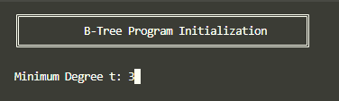

- Main Menu
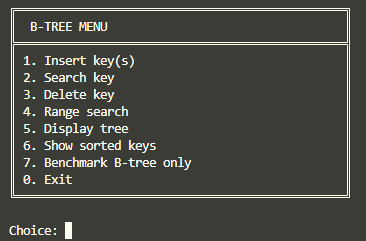

- Insert Key
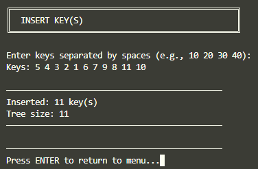

- Search Key
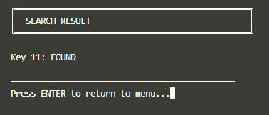
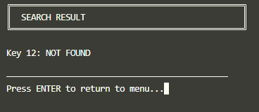

- Delete Key
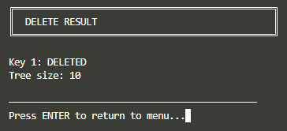

- Range Search
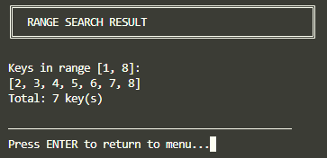

- Display Tree
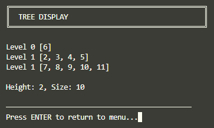

- Show Sorted Keys
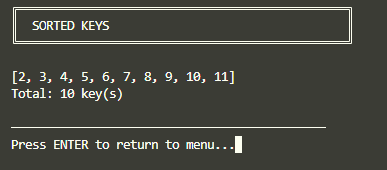

- Benchmark B-Tree
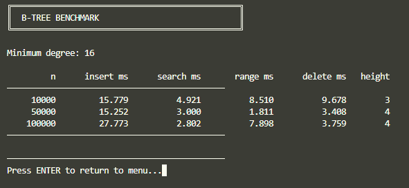

### Program B+ Tree

#### Gambaran Umum Program B+ Tree

`BPlusTreeProgram` adalah program Java yang mengimplementasikan B+ Tree dengan key dan value bertipe `int`. Pada implementasi ini, value yang disimpan sama dengan key karena method insert memanggil `insert(root, key, key)`. Dalam konteks indeks database, value dapat dibayangkan sebagai record pointer, tetapi pada program ini value disederhanakan menjadi `int` yang sama dengan key.

`B+ Tree` pada program ini menggunakan dua jenis node, yaitu `InternalNode` dan `LeafNode`. Internal node menyimpan separator dan child pointer, sedangkan leaf node menyimpan key-value dan pointer `next` menuju leaf berikutnya. Pointer `next` inilah yang membuat range search dan traversal sorted lebih efisien secara konseptual.

#### Penjelasan Implementasi Pada Kode

- Class
```java
public class BPlusTreeProgram {
    public static class BPlusTree {
        private abstract static class Node { ... }
        private static class InternalNode extends Node { ... }
        private static class LeafNode extends Node { ... }
        private static class Split { ... }

        private LeafNode firstLeaf;
        private Node root;
        private final int minimumDegree;
        private final int maxKeys;
        private final int minKeys;
        private int size;
    }

    public static void main(String[] args) { ... }
}
```
Class `Node` dibuat abstract agar internal node dan leaf node memiliki basis yang sama, yaitu `keys`. Method `isLeaf()` dipakai untuk membedakan perilaku node saat insert, search, delete, dan print tree.

- Struktur Node pada B+ Tree

`B+ Tree` menggunakan tiga struktur node utama: `Node`, `InternalNode`, dan `LeafNode`. Internal node memiliki daftar child, sedangkan leaf node memiliki daftar value dan pointer ke leaf berikutnya.

```java
private abstract static class Node {
    List<Integer> keys = new ArrayList<>();

    abstract boolean isLeaf();
}

private static class InternalNode extends Node {
    List<Node> children = new ArrayList<>();

    boolean isLeaf() {
        return false;
    }
}

private static class LeafNode extends Node {
    List<Integer> values = new ArrayList<>();
    LeafNode next;

    boolean isLeaf() {
        return true;
    }
}
```

Penggunaan `ArrayList` membuat operasi penambahan, penghapusan, dan pemotongan sublist lebih ringkas dibanding array manual. Namun, dari sisi performa di dalam node, operasi insert atau remove di tengah list tetap membutuhkan shifting elemen.

- Inisialisasi B+ Tree

Constructor `B+ Tree` menerima `minimumDegree`, lalu menghitung `maxKeys` dan `minKeys`. Root awal adalah leaf kosong, dan `firstLeaf` menunjuk ke root tersebut.

```java
public BPlusTree(int minimumDegree) {
    if (minimumDegree < 2) {
        throw new IllegalArgumentException("Minimum degree must be at least 2");
    }
    this.minimumDegree = minimumDegree;
    this.maxKeys = 2 * minimumDegree - 1;
    this.minKeys = minimumDegree - 1;
    this.firstLeaf = new LeafNode();
    this.root = firstLeaf;
    this.size = 0;
}
```

Field `firstLeaf` adalah pointer penting pada `B+ Tree`. Pointer ini memungkinkan traversal semua key secara berurutan tanpa harus melakukan DFS dari root. Setelah delete dan kemungkinan perubahan struktur, program memanggil `resetFirstLeaf` untuk memastikan pointer ini tetap mengarah ke leaf paling kiri.

- B+ Tree - Search

Search pada B+ Tree selalu turun sampai leaf. Program menggunakan `findLeaf` untuk memilih child berdasarkan separator internal, kemudian melakukan pencarian posisi key di leaf menggunakan `lowerBound`.

```java
public boolean search(int key) {
    LeafNode leaf = findLeaf(key);
    int index = lowerBound(leaf.keys, key);
    return index < leaf.keys.size() && leaf.keys.get(index) == key;
}

private LeafNode findLeaf(int key) {
    Node current = root;
    while (!current.isLeaf()) {
        InternalNode internal = (InternalNode) current;
        current = internal.children.get(childIndex(internal.keys, key));
    }
    return (LeafNode) current;
}
```

Method `childIndex` menentukan child yang harus dipilih. Jika key lebih besar atau sama dengan separator tertentu, index child bergerak ke kanan. Ini sesuai dengan fungsi internal key sebagai batas pemisah antar subtree.

```java
private int childIndex(List<Integer> keys, int key) {
    int index = 0;
    while (index < keys.size() && key >= keys.get(index)) {
        index++;
    }
    return index;
}
```

- Lower Bound

`lowerBound` menggunakan binary search untuk mencari posisi pertama dengan nilai lebih besar atau sama dengan key target. Method ini dipakai pada search dan insert leaf.

```java
private int lowerBound(List<Integer> keys, int key) {
    int low = 0;
    int high = keys.size();
    while (low < high) {
        int middle = low + (high - low) / 2;
        if (keys.get(middle) < key) {
            low = middle + 1;
        } else {
            high = middle;
        }
    }
    return low;
}
```

Dengan `lowerBound`, program dapat menjaga posisi insert tetap terurut. Saat search, posisi hasil `lowerBound` cukup dicek apakah masih dalam ukuran list dan apakah nilainya sama dengan key target.

- B+ Tree - Insert

Insert B+ Tree menolak duplikasi key dengan search terlebih dahulu. Jika key belum ada, program memanggil insert rekursif dari root. Jika root menghasilkan split, root baru dibuat sebagai internal node dengan dua child.

```java
public boolean insert(int key) {
    if (search(key)) {
        return false;
    }

    Split split = insert(root, key, key);
    if (split != null) {
        InternalNode newRoot = new InternalNode();
        newRoot.children.add(root);
        newRoot.children.add(split.rightNode);
        rebuildKeys(newRoot);
        root = newRoot;
    }
    size++;
    return true;
}
```

Parameter value pada insert internal diisi sama dengan key. Ini membuat program tetap dapat mendemonstrasikan konsep key-value pada leaf `B+ Tree`, meskipun belum memakai record object atau pointer file seperti pada sistem database nyata.

Jika node yang dikunjungi adalah leaf, key dan value dimasukkan pada posisi terurut. Jika jumlah key leaf melebihi `maxKeys`, leaf di-split. Jika node yang dikunjungi adalah internal node, program turun ke child yang sesuai, lalu menambahkan right node hasil split jika child tersebut pecah.

```java
private Split insert(Node node, int key, int value) {
    if (node.isLeaf()) {
        LeafNode leaf = (LeafNode) node;
        int index = lowerBound(leaf.keys, key);
        leaf.keys.add(index, key);
        leaf.values.add(index, value);

        if (leaf.keys.size() <= maxKeys) {
            return null;
        }
        return splitLeaf(leaf);
    }

    InternalNode internal = (InternalNode) node;
    int childIndex = childIndex(internal.keys, key);
    Split split = insert(internal.children.get(childIndex), key, value);
    if (split == null) {
        rebuildKeys(internal);
        return null;
    }

    internal.children.add(childIndex + 1, split.rightNode);
    rebuildKeys(internal);

    if (internal.keys.size() <= maxKeys) {
        return null;
    }
    return splitInternal(internal);
}
```

Ciri penting implementasi ini adalah penggunaan `rebuildKeys`. Alih-alih menyisipkan separator secara manual di posisi tertentu, program membangun ulang semua separator internal berdasarkan key pertama dari setiap child mulai child kedua. Ini membuat struktur separator lebih mudah dijaga setelah split, borrowing, atau merge.

- B+ Tree - Split

Program ini memakai class kecil bernama `Split` untuk mengembalikan hasil pembelahan node. Ketika sebuah node di-split, method perlu memberi tahu parent tentang separator dan node kanan baru.

```java
private static class Split {
    int separator;
    Node rightNode;

    Split(int separator, Node rightNode) {
        this.separator = separator;
        this.rightNode = rightNode;
    }
}
```

Walaupun `separator` disimpan dalam object `Split`, implementasi parent pada program ini lebih sering membangun ulang separator menggunakan `rebuildKeys`. Dengan demikian, separator dipakai sebagai informasi hasil split, tetapi konsistensi akhir internal key dijaga oleh proses rebuild berdasarkan key pertama subtree kanan.

- B+ Tree - Split Leaf

Split leaf membagi leaf menjadi dua bagian. Separuh kanan dipindahkan ke leaf baru, lalu pointer `next` diatur agar leaf chain tetap terhubung.

```java
private Split splitLeaf(LeafNode leaf) {
    LeafNode rightLeaf = new LeafNode();
    int splitIndex = leaf.keys.size() / 2;

    rightLeaf.keys.addAll(leaf.keys.subList(splitIndex, leaf.keys.size()));
    rightLeaf.values.addAll(leaf.values.subList(splitIndex, leaf.values.size()));
    leaf.keys.subList(splitIndex, leaf.keys.size()).clear();
    leaf.values.subList(splitIndex, leaf.values.size()).clear();

    rightLeaf.next = leaf.next;
    leaf.next = rightLeaf;
    return new Split(rightLeaf.keys.get(0), rightLeaf);
}
```

Pada B+ Tree, key separator yang naik ke parent adalah key pertama dari leaf kanan. Berbeda dari B-Tree, key tersebut tetap berada di leaf kanan, karena data efektif tetap disimpan pada leaf.

- B+ Tree - Split Internal

Split internal membagi daftar child menjadi dua internal node. Setelah child dipindahkan, key internal dibangun ulang berdasarkan key pertama dari subtree masing-masing child.

```java
private Split splitInternal(InternalNode internal) {
    InternalNode rightInternal = new InternalNode();
    int splitChildIndex = internal.children.size() / 2;

    rightInternal.children.addAll(internal.children.subList(splitChildIndex, internal.children.size()));
    internal.children.subList(splitChildIndex, internal.children.size()).clear();

    rebuildKeys(internal);
    rebuildKeys(rightInternal);
    return new Split(firstKey(rightInternal), rightInternal);
}
```

Karena internal node B+ Tree hanya berfungsi sebagai navigator, program tidak perlu memindahkan key tengah dengan cara yang sama seperti B-Tree. Yang penting adalah pembagian child tetap valid dan separator parent dapat mengarahkan pencarian ke subtree yang benar.

- Rebuild Separator

Method `firstKey` mencari key pertama dari sebuah subtree dengan berjalan ke child paling kiri sampai leaf. Method `rebuildKeys` kemudian memakai `firstKey` dari setiap child mulai child kedua sebagai separator internal.

```java
private int firstKey(Node node) {
    Node current = node;
    while (!current.isLeaf()) {
        current = ((InternalNode) current).children.get(0);
    }
    LeafNode leaf = (LeafNode) current;
    if (leaf.keys.isEmpty()) {
        return Integer.MIN_VALUE;
    }
    return leaf.keys.get(0);
}

private void rebuildKeys(InternalNode internal) {
    internal.keys.clear();
    for (int i = 1; i < internal.children.size(); i++) {
        internal.keys.add(firstKey(internal.children.get(i)));
    }
}
```

Hal ini ini membuat internal key selalu merepresentasikan batas awal dari child kanan.

- B+ Tree - Delete

Delete B+ Tree dimulai dengan search. Jika key tidak ada, method mengembalikan `false`. Jika key ada, delete rekursif dijalankan, root dikecilkan jika hanya menyisakan satu child, lalu `firstLeaf` di-reset.

```java
public boolean delete(int key) {
    if (!search(key)) {
        return false;
    }
    delete(root, key, null, -1);
    shrinkRootIfNeeded();
    resetFirstLeaf();
    size--;
    return true;
}
```

Jika node saat ini adalah leaf, key dan value dihapus dari list. Jika node saat ini internal, program turun ke child yang sesuai lalu membangun ulang separator internal. Setelah itu, jika node bukan root dan jumlah key kurang dari `minKeys`, program melakukan rebalance.

```java
private void delete(Node node, int key, InternalNode parent, int childPosition) {
    if (node.isLeaf()) {
        LeafNode leaf = (LeafNode) node;
        int index = lowerBound(leaf.keys, key);
        if (index < leaf.keys.size() && leaf.keys.get(index) == key) {
            leaf.keys.remove(index);
            leaf.values.remove(index);
        }
    } else {
        InternalNode internal = (InternalNode) node;
        int index = childIndex(internal.keys, key);
        delete(internal.children.get(index), key, internal, index);
        rebuildKeys(internal);
    }

    if (node != root && node.keys.size() < minKeys) {
        rebalance(parent, childPosition);
    }
}
```

Rebalance dibutuhkan agar node tidak berada di bawah jumlah key minimum. Karena B+ Tree memiliki leaf chain dan separator internal, rebalance juga harus memastikan pointer leaf dan separator parent tetap konsisten.

- Rebalance

Method `rebalance` mengambil node yang kekurangan key, sibling kiri, dan sibling kanan. Jika node adalah leaf, program memanggil `rebalanceLeaf`. Jika node adalah internal node, program memanggil `rebalanceInternal`.

```java
private void rebalance(InternalNode parent, int index) {
    if (parent == null || index < 0 || index >= parent.children.size()) {
        return;
    }

    Node node = parent.children.get(index);
    Node leftSibling = index > 0 ? parent.children.get(index - 1) : null;
    Node rightSibling = index + 1 < parent.children.size() ? parent.children.get(index + 1) : null;

    if (node.isLeaf()) {
        rebalanceLeaf(parent, index, (LeafNode) node, leftSibling, rightSibling);
    } else {
        rebalanceInternal(parent, index, (InternalNode) node, leftSibling, rightSibling);
    }
    rebuildKeys(parent);
}
```

Setelah borrowing atau merge selesai, parent selalu menjalankan `rebuildKeys`. Ini penting karena separator parent mungkin berubah setelah key pertama suatu leaf atau subtree berubah.

- Rebalaance Leaf

Rebalance leaf mencoba borrowing dari sibling kiri terlebih dahulu. Jika sibling kiri memiliki key lebih dari batas minimum, key terakhir sibling kiri dipindahkan ke awal leaf yang kekurangan key.

```java
if (leftSibling instanceof LeafNode && leftSibling.keys.size() > minKeys) {
    LeafNode leftLeaf = (LeafNode) leftSibling;
    int lastIndex = leftLeaf.keys.size() - 1;
    leaf.keys.add(0, leftLeaf.keys.remove(lastIndex));
    leaf.values.add(0, leftLeaf.values.remove(lastIndex));
    return;
}
```

Jika sibling kiri tidak bisa memberi key, program mencoba sibling kanan. Key pertama sibling kanan dipindahkan ke akhir leaf saat ini.

```java
if (rightSibling instanceof LeafNode && rightSibling.keys.size() > minKeys) {
    LeafNode rightLeaf = (LeafNode) rightSibling;
    leaf.keys.add(rightLeaf.keys.remove(0));
    leaf.values.add(rightLeaf.values.remove(0));
    return;
}
```

Jika borrowing tidak bisa dilakukan, program melakukan merge. Merge dengan sibling kiri menggabungkan leaf saat ini ke sibling kiri dan mengatur ulang pointer `next`.

```java
if (leftSibling instanceof LeafNode) {
    LeafNode leftLeaf = (LeafNode) leftSibling;
    leftLeaf.keys.addAll(leaf.keys);
    leftLeaf.values.addAll(leaf.values);
    leftLeaf.next = leaf.next;
    parent.children.remove(index);
    return;
}
```

Jika hanya sibling kanan yang tersedia, sibling kanan digabung ke leaf saat ini, lalu pointer `next` melewati sibling kanan.

```java
if (rightSibling instanceof LeafNode) {
    LeafNode rightLeaf = (LeafNode) rightSibling;
    leaf.keys.addAll(rightLeaf.keys);
    leaf.values.addAll(rightLeaf.values);
    leaf.next = rightLeaf.next;
    parent.children.remove(index + 1);
}
```

- Rebalance Internal

Rebalance internal bekerja pada level child pointer, bukan langsung pada key data. Jika sibling kiri memiliki child lebih dari minimum degree, satu child terakhir sibling kiri dipindahkan ke awal internal node yang kekurangan.

```java
if (leftSibling instanceof InternalNode && ((InternalNode) leftSibling).children.size() > minimumDegree) {
    InternalNode leftInternal = (InternalNode) leftSibling;
    Node borrowedChild = leftInternal.children.remove(leftInternal.children.size() - 1);
    internal.children.add(0, borrowedChild);
    rebuildKeys(leftInternal);
    rebuildKeys(internal);
    return;
}
```

Jika sibling kanan memiliki child berlebih, child pertama sibling kanan dipindahkan ke akhir internal node saat ini.

```java
if (rightSibling instanceof InternalNode && ((InternalNode) rightSibling).children.size() > minimumDegree) {
    InternalNode rightInternal = (InternalNode) rightSibling;
    Node borrowedChild = rightInternal.children.remove(0);
    internal.children.add(borrowedChild);
    rebuildKeys(rightInternal);
    rebuildKeys(internal);
    return;
}
```

Jika borrowing tidak bisa dilakukan, internal node digabung dengan sibling kiri atau sibling kanan. Setelah penggabungan, parent menghapus child pointer yang sudah tidak digunakan.

```java
if (leftSibling instanceof InternalNode) {
    InternalNode leftInternal = (InternalNode) leftSibling;
    leftInternal.children.addAll(internal.children);
    rebuildKeys(leftInternal);
    parent.children.remove(index);
    return;
}

if (rightSibling instanceof InternalNode) {
    InternalNode rightInternal = (InternalNode) rightSibling;
    internal.children.addAll(rightInternal.children);
    rebuildKeys(internal);
    parent.children.remove(index + 1);
}
```

- B+ Tree - Range Search

Range search pada `B+ Tree` memanfaatkan leaf chain. Program mencari leaf pertama yang mungkin memuat `low`, lalu bergerak dari leaf ke leaf berikutnya sampai key melebihi `high`.

```java
public List<Integer> rangeSearch(int low, int high) {
    List<Integer> result = new ArrayList<>();
    if (low > high) {
        return result;
    }

    LeafNode leaf = findLeaf(low);
    while (leaf != null) {
        for (int i = 0; i < leaf.keys.size(); i++) {
            int key = leaf.keys.get(i);
            if (key > high) {
                return result;
            }
            if (key >= low) {
                result.add(leaf.values.get(i));
            }
        }
        leaf = leaf.next;
    }
    return result;
}
```

Inilah fitur yang paling menunjukkan keunggulan `B+ Tree` untuk query rentang. Setelah leaf awal ditemukan, program tidak perlu kembali ke parent atau melakukan DFS. Program cukup mengikuti pointer `next` pada leaf.

- B+ Tree - Traverse Sorted

Traversal semua key pada `B+ Tree` dilakukan melalui leaf chain, mulai dari `firstLeaf`. Karena setiap leaf menyimpan key secara terurut dan leaf saling terhubung dari kiri ke kanan, hasil traversal otomatis terurut.

```java
public List<Integer> traverse() {
    List<Integer> result = new ArrayList<>();
    LeafNode current = firstLeaf;
    while (current != null) {
        result.addAll(current.keys);
        current = current.next;
    }
    return result;
}
```

Fitur ini lebih sederhana dibanding inorder traversal `B-Tree`. Program tidak perlu mengunjungi internal node karena internal node hanya berperan sebagai separator.

- B+ Tree - Display Tree

Display tree pada `B+ Tree` menampilkan tipe node, level, dan daftar key pada setiap node. Setelah struktur tree dicetak, program juga mencetak leaf chain.

```java
public void printTree() {
    if (root.keys.isEmpty()) {
        System.out.println("Tree is empty");
        return;
    }
    printTree(root, 0);
    printLeafChain();
}

private void printTree(Node node, int level) {
    String type = node.isLeaf() ? "Leaf" : "Internal";
    System.out.println("Level " + level + " " + type + " " + node.keys);
    if (!node.isLeaf()) {
        InternalNode internal = (InternalNode) node;
        for (Node child : internal.children) {
            printTree(child, level + 1);
        }
    }
}
```

Leaf chain dicetak untuk menunjukkan koneksi antar leaf. Ini membantu untuk memahami bahwa B+ Tree juga memiliki jalur sekuensial pada level leaf.

```java
private void printLeafChain() {
    System.out.print("Leaf chain: ");
    LeafNode current = firstLeaf;
    while (current != null) {
        System.out.print(current.keys);
        if (current.next != null) {
            System.out.print(" -> ");
        }
        current = current.next;
    }
    System.out.println();
}
```

- B+ Tree - Benchmark

Benchmark `B+ Tree` memakai pola yang sama dengan B-Tree. Program menguji tiga ukuran data, yaitu `10_000`, `50_000`, dan `100_000`. Minimum degree benchmark ditetapkan `16`, dan jumlah operasi search/delete dibatasi oleh `operationCount`.

```java
int[] sizes = {10_000, 50_000, 100_000};
int minimumDegree = 16;
int operationCount = 20_000;
Random random = new Random(42);
```

Range search diuji 1000 kali dengan interval sekitar 100 key. Pada `B+ Tree`, bagian ini menunjukkan penggunaan leaf chain untuk mengumpulkan hasil dalam rentang.

```java
long rangeStart = System.nanoTime();
int rangeCount = 0;
for (int i = 0; i < 1000; i++) {
    int low = random.nextInt(Math.max(1, n - 100));
    rangeCount += tree.rangeSearch(low, low + 100).size();
}
long rangeTime = System.nanoTime() - rangeStart;
```

Sama seperti benchmark `B-Tree`, hasil benchmark ini sebaiknya dipahami sebagai indikator kasar. Untuk pengukuran yang lebih serius, perlu warm-up JVM, beberapa repetisi, isolasi proses, dan mungkin framework benchmark seperti JMH.

### Demonstrasi Program

- Inisialisai Program
  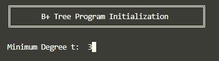

- Main Menu
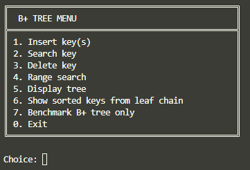

- Insert Keys
  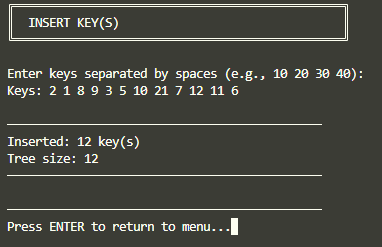

- Search Key
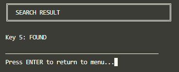
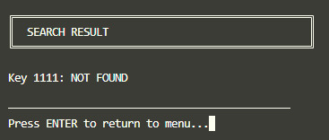

- Delete Key
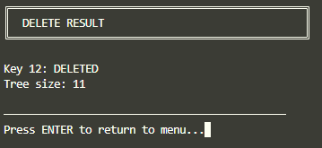

- Range Search
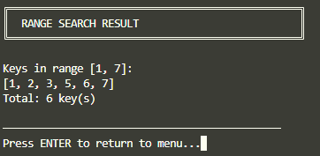

- Display Tree
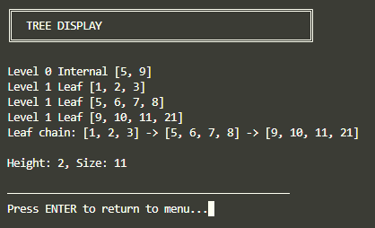

- Show Sorted Key from Leaf Chain
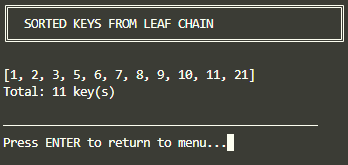

- Benchmark
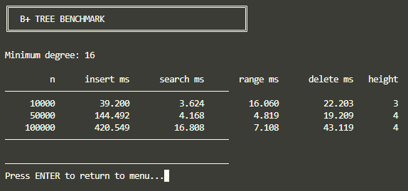

## Perbandingan Performa Kedua Tree pada Program

Untuk membantu membandingkan performa B-Tree dan B+ Tree secara realtime dan presisi, kami membuat satu program tambahan yaitu [PerformanceComparison.java](PerformanceComparison.java).

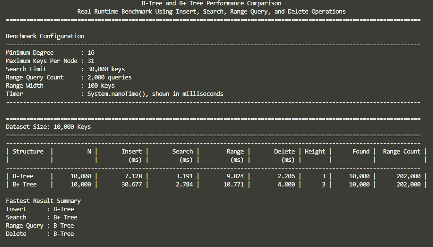
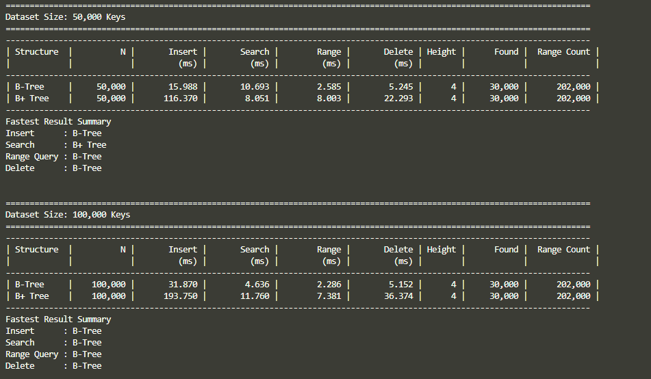
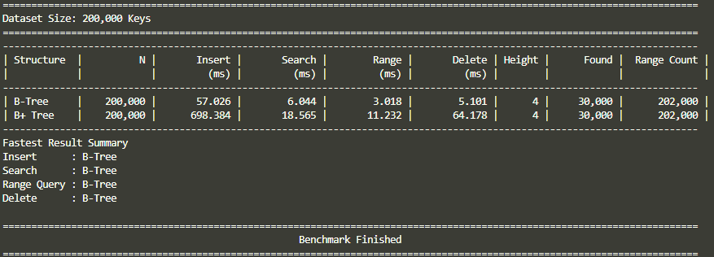

Berdasarkan hasil benchmark program, `B-Tree` menunjukkan performa lebih cepat dibandingkan `B+ Tree` pada sebagian besar operasi. Hasil ini tidak sepenuhnya bertentangan dengan teori, karena benchmark dilakukan pada implementasi Java berbasis memori, bukan pada sistem database berbasis disk atau block/page.

Selain itu, implementasi `B-Tree` dalam program menggunakan array primitif `int[]` dan `Node[]`, sedangkan implementasi `B+ Tree` menggunakan `ArrayList<Integer>` dan `ArrayList<Node>`. Perbedaan struktur internal ini menyebabkan `B+ Tree` memiliki overhead tambahan berupa object allocation, boxing/unboxing, dan akses list yang lebih mahal.

Pada implementasi `B+ Tree`, proses insert dan delete juga sering memanggil `rebuildKeys`, yaitu proses membangun ulang separator key pada internal node. Proses ini membuat `B+ Tree` melakukan pekerjaan tambahan yang tidak dilakukan oleh `B-Tree`. Karena itu, hasil benchmark lebih merepresentasikan performa implementasi program, bukan semata-mata perbandingan teoretis antara `B-Tree` dan `B+ Tree`.

Secara teori,` B+ Tree` tetap memiliki keunggulan untuk range query dan sequential access karena seluruh data berada di leaf node yang saling terhubung. Namun, keunggulan ini akan lebih terlihat pada sistem database berbasis block storage atau jika implementasi `B+ Tree` dibuat lebih optimal, misalnya menggunakan array primitif, fan-out internal yang lebih besar, dan pembaruan separator key secara incremental.